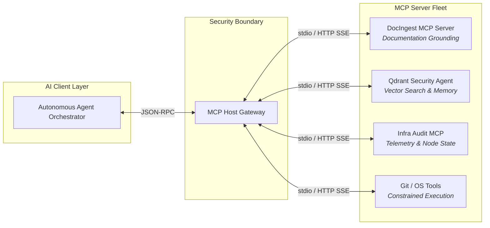

# Model Context Protocol (MCP): The Nervous System for Local AI Agent Swarms

> [!abstract] Architectural Guide
> As enterprise operations transition from single-prompt chat interfaces to autonomous, multi-agent AI engineering swarms, standardizing how models interact with external tools, databases, and environments is paramount. The **Model Context Protocol (MCP)** provides the open, deterministic standard needed to connect AI reasoning engines directly to local infrastructure without compromising security.

---

## 1. The Limitation of Traditional LLM Tool Calling

Historically, connecting an LLM to local scripts required proprietary JSON function-calling definitions, fragile custom wrappers, and bespoke orchestration code. This led to:
1. **Context Fragmentation:** Tools were tied to specific client frameworks.
2. **Security Vulnerabilities:** Granting arbitrary shell access to an agent without strict capability boundaries exposed the underlying host to prompt injection.
3. **Hallucination on Legacy APIs:** Without verified, deterministic documentation grounding, models frequently invented non-existent API parameters.

---

## 2. The MCP Architectural Model

MCP decouples the **LLM Client** (IDE, CLI, Agent Orchestrator) from the **Tool Provider (MCP Server)** using JSON-RPC 2.0 over standard I/O (`stdio`) or Server-Sent Events (SSE).

---

## 3. Production MCP Implementations in Our Fleet

### A. DocIngest MCP Server (`docingest`)
Provides agents with verified, topic-filtered documentation from canonical repositories (React, Quartz, Docker, OpenWrt, Linux kernel):
* **`find-docs`**: Discovers relevant documentation libraries by keyword.
* **`read-docs`**: Fetches full parsed Markdown trees.
* **`query-docs`**: Performs semantic search across indexed libraries.

### B. Qdrant Security Analysis Agent (`qdrant-security-agent`)
Enables cross-session agent memory, threat intel lookups (Shodan, CVE databases), and persistent architectural context.

### C. Infrastructure Audit Engine (`infra-audit-engine`)
Exposes live hardware status, OpenWrt firewall zoning, and container state across nodes (`edge`, `t430`, `llmadmin01`) as structured JSON payloads.

---

## 4. Security Guardrails & Zero Trust Best Practices

1. **Principle of Least Privilege:** Tools must be granular and atomic. An MCP server should expose discrete actions (`get_node_status`, `query_docs`) rather than unrestricted raw shell execution.
2. **Schema Validation:** Enforce strict JSON Schema verification (e.g. via Zod) on all inputs before executing host operations.
3. **Audit Logging & Telemetry:** Every tool call, execution timestamp, and response payload must be logged to an append-only telemetry stream for forensic auditing.

---

## 🔗 Related Architecture & Knowledge Graph

* **Production Systems:** Validated in [[LLM_Control_Plane|LLM Control Plane]], [[MCP_Gateway_Tool_Router|MCP Gateway Tool Router]], [[Serverless_Cloudflare_MCP|Serverless Cloudflare MCP]].
* **Governance & Compliance:** Governed by [[Governance/Policies/AI_Augmentation_for_Users|AI Augmentation for Users]].
* **Applied Research:** Investigated in [[Local_LLM_Architecture|Local LLM Architecture]], [[Research/Security_Analysis_and_Research_Agent/Agents_and_Architecture|Agents and Architecture]].
* **Professional Background:** Authored by Richard P. Dissell ([[Resume/Master_Resume|Master Resume]]).
* **Digital Garden Hub:** Return to the main [[docs/index|Digital Garden Index]].
