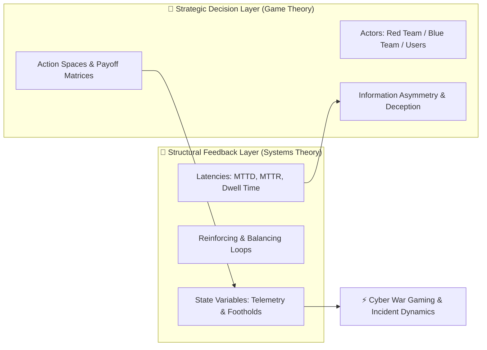
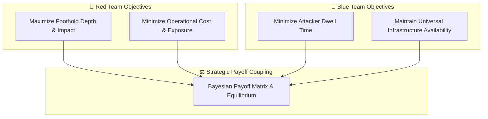
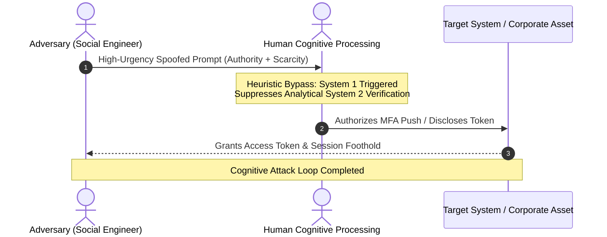
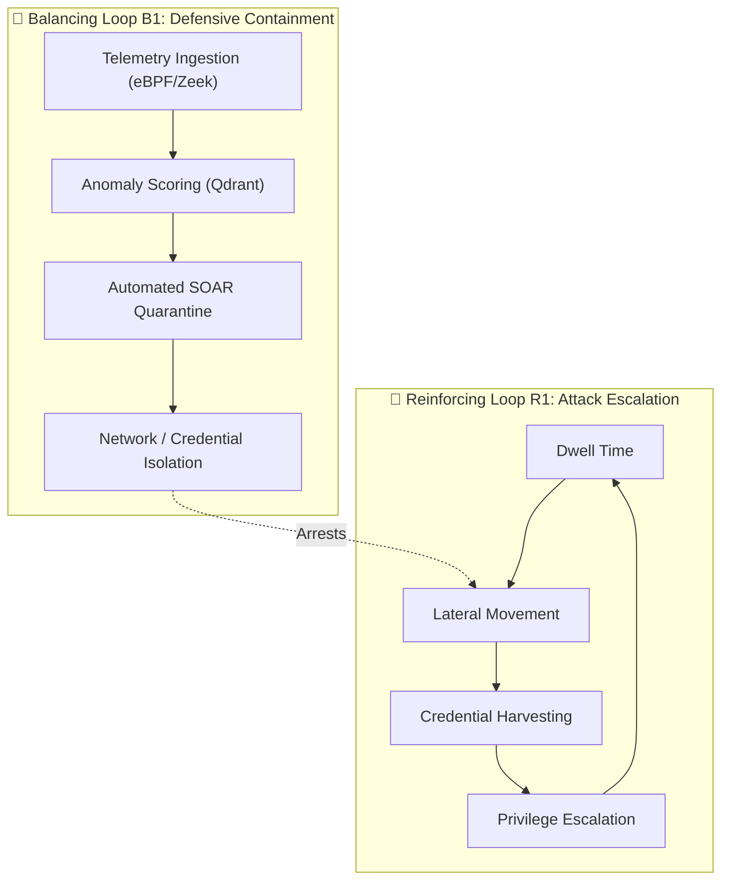

# Games & Systems Theory
## **Strategic Decision-Making, Feedback Dynamics, Cyber War Gaming & Cognitive Exploitation**

> [!abstract] Executive Thesis
> Games and systems theory intersect when we model interactive environments—whether economic markets, biological ecosystems, or cyber conflict—as networks of interdependent rules, autonomous actors, and dynamic feedback loops. **Game theory** models strategic decision-making between rational or bounded agents competing for payoffs under conditions of incomplete information. **Systems theory** models how the structural environment, information delays, and feedback topologies behave and evolve over time.
>
> When applied to cybersecurity, this synthesis provides the mathematical and operational foundation for **cyber war gaming**, **Red Team vs. Blue Team asymmetry**, and the systematic exploitation and defense of the **human cognitive attack surface (social engineering)**.

---

## 1. Mathematical Foundations: Games vs. Systems

Cybersecurity is neither a static checklist nor a purely mechanical system; it is an adversarial, non-cooperative, dynamic multi-agent game played upon a complex, evolving distributed system.

### Extensive-Form Games with Imperfect Information

An enterprise cyber engagement is formally characterized as an **Extensive-Form Game with Imperfect Information**:

$$
\mathcal{G} = \langle \mathcal{N}, \mathcal{H}, \mathcal{P}, \mathcal{I}, \mathcal{U} \rangle
$$

Where:
- $\mathcal{N} = \{\text{Red}, \text{Blue}, \text{Users}, \text{Nature}\}$ is the set of participating agents.
- $\mathcal{H}$ is the set of all sequential history sequences of actions taken across the network.
- $\mathcal{P}: \mathcal{H} \to \mathcal{N}$ determines whose turn it is to act after history $h \in \mathcal{H}$.
- $\mathcal{I} = \{\mathcal{I}_{\text{Red}}, \mathcal{I}_{\text{Blue}}\}$ represents the **information partition**: the defender cannot observe attacker actions occurring within unmonitored blind spots, and the attacker cannot observe defender internal SIEM detection thresholds.
- $\mathcal{U}_i: \mathcal{H}_{\text{terminal}} \to \mathbb{R}$ represents the utility/payoff function for agent $i$.

### Dynamical Systems & State Feedback

While game theory determines the chosen action $a_t \in \mathcal{A}$, systems theory models the evolution of the overall environment state $\mathbf{x}(t) \in \mathbb{R}^n$ (e.g., compromised credentials, network bandwidth, host integrity):

$$
\dot{\mathbf{x}}(t) = f(\mathbf{x}(t), \mathbf{u}_{\text{Red}}(t), \mathbf{u}_{\text{Blue}}(t), \mathbf{w}(t))
$$

Where $\mathbf{u}_{\text{Red}}$ represents attack vectors, $\mathbf{u}_{\text{Blue}}$ represents defensive interventions, and $\mathbf{w}(t)$ represents environmental noise (background network traffic, human errors, system updates).

---

## 2. Cyber War Gaming & The Asymmetric Red vs. Blue Dynamic

### The Defender's Dilemma as an Asymmetric Game

Traditional military war gaming relies on symmetric or near-symmetric force projection. Cyber war gaming, however, is defined by profound structural asymmetry:

1. **Surface Cardinality Asymmetry**: The defender must secure all $N$ exposed surfaces ($N \to \infty$ across APIs, edge routers, workstations, employees); the attacker needs only a single exploitable path ($k = 1$).
2. **Economic Cost Asymmetry**: The marginal cost for an attacker to launch automated reconnaissance or phishing campaigns approaches zero, whereas the marginal cost of human analyst incident triage scales linearly with alert volume.

### Formal Payoff Matrix Formulation

Let $a_i \in \mathcal{A}_{\text{Red}}$ be an offensive technique (e.g., living-off-the-land binary execution) and $d_j \in \mathcal{D}_{\text{Blue}}$ be a defensive control (e.g., eBPF kernel tracing with automated isolation):

$$
\mathcal{U}_{\text{Red}}(a_i, d_j) = \text{AssetValue}(a_i) - \text{ExecutionCost}(a_i) - \mathbb{P}_{\text{detect}}(a_i, d_j) \cdot \text{AttributionPenalty}
$$

$$
\mathcal{U}_{\text{Blue}}(a_i, d_j) = -\text{AssetValue}(a_i) \cdot \big(1 - \mathbb{P}_{\text{detect}}(a_i, d_j)\big) - \text{OperationalOverhead}(d_j)
$$

Under this payoff structure, a static defense always loses: the attacker calculates the lowest-cost path where $\mathbb{P}_{\text{detect}}(a_i, d_j) \approx 0$.

### Deception Technology as Information Asymmetry Inversion

To counter this asymmetry, defenders introduce **Game-Theoretic Deception** (Canary tokens, honeypots, fake Active Directory service accounts, decoy network shares). 

Deception fundamentally alters the attacker's expected utility:

$$
\mathbb{E}[\mathcal{U}_{\text{Red}}(a_i)] = (1 - p_{\text{decoy}}) \cdot \mathcal{U}_{\text{real}} + p_{\text{decoy}} \cdot (-\text{DetectionPenalty})
$$

When the density of high-fidelity decoys $p_{\text{decoy}}$ reaches a critical threshold, the attacker's dominant strategy shifts from aggressive lateral movement to extreme caution, drastically increasing their operational latency and cost.

---

## 3. Social Engineering as Cognitive Game Theory

Social engineering is not an anomaly or random human failure; it is the **systematic exploitation of bounded rationality within human decision nodes**.

### Bounded Rationality & Heuristic Shortcuts

Herbert Simon's theory of **Bounded Rationality** proves that human agents cannot evaluate global payoff matrices in real time. Instead, they rely on fast cognitive heuristics (Daniel Kahneman's **System 1 Thinking**):

- **Authority Gradient**: Deferring analytical validation when a command appears to originate from an executive or regulatory authority.
- **Artificial Scarcity / Temporal Urgency**: Artificially compressing the decision window to force System 1 processing and prevent deliberate System 2 analytical verification.
- **Trust Transitivity**: Exploiting pre-established trust in third-party platforms (e.g., Slack, Teams, Google Docs) to deliver malicious payloads.

### Bayesian Belief Manipulation

The attacker manipulates the victim's Bayesian prior probability that a request is legitimate:

$$
P(\text{Legitimacy} \mid \text{Context}) = \frac{P(\text{Context} \mid \text{Legitimacy}) \cdot P(\text{Legitimacy})}{P(\text{Context})}
$$

By synthesizing context from OSINT, executive calendars, and internal communication cadence, the attacker maximizes $P(\text{Context} \mid \text{Legitimacy})$, causing the user's posterior trust probability to cross the authorization threshold without cryptographic verification.

### Systemic Architectural Antidotes

Because cognitive heuristics cannot be permanently "patched" via periodic compliance videos, systems theory demands **architectural, non-cognitive safeguards**:

1. **Hardware-Enforced Cryptographic Boundaries**: Replacing human trust evaluation with phishing-resistant FIDO2/WebAuthn tokens (`origin`-bound passkeys).
2. **Two-Man Rule / Multi-Party Consensus**: Designing operational workflows where high-consequence state changes (wire transfers, DNS modifications, policy adjustments) require independent, asynchronous cryptographic sign-offs.
3. **Intentional Structural Friction**: Injecting mandatory out-of-band verification delays into high-risk transaction pipelines.

---

## 4. Systems Feedback Loops in Incident Response

A cyber incident is governed by the interplay between **Reinforcing (Destabilizing) Loops** and **Balancing (Stabilizing) Loops**:

### The Fundamental Temporal Stability Criterion

For an enterprise system to remain dynamically stable under continuous adversary probing, the feedback latency of the defensive balancing loop must satisfy the **Temporal Stability Criterion**:

$$
\text{MTTD} + \text{MTTR} < \text{MTTC}
$$

Where:
- $\text{MTTD}$: Mean Time to Detect (Telemetry generation $\to$ Anomaly scoring $\to$ Alerting).
- $\text{MTTR}$: Mean Time to Respond (Triage $\to$ SOAR playbook execution $\to$ Boundary isolation).
- $\text{MTTC}$: Mean Time to Compromise (Attacker initial execution $\to$ Domain persistence / Exfiltration).

If $\text{MTTD} + \text{MTTR} > \text{MTTC}$, the reinforcing attack loop outruns the defensive feedback governor, leading to total systemic compromise.

---

## 5. Applied War Game Simulation Engines

To operationalize these principles, modern defense relies on **high-concurrency, distributed simulation testbeds**:

| Simulation Layer | Technical Implementation | Systems Theory Relevance |
| :--- | :--- | :--- |
| **State Synchronization** | Deterministic tick rates (20Hz - 128Hz) pinned to isolated CPU cores (`taskset`, `cgroups`). | Ensures repeatable, cycle-accurate war game simulations of adversary actions. |
| **Actor Models & Spatial Partitioning** | Partitioning virtual networks into discrete collision grids and security zones. | Prevents $O(N^2)$ state explosion during multi-agent red/blue team emulations. |
| **Autonomous Agent Swarms** | Local LLM-driven red and blue agents interacting over Model Context Protocol (MCP) and Qdrant memory. | Simulates emergent adversary tactics, cognitive phishing variations, and defensive counter-strategies. |

---

## 6. Synthesis & Strategic Conclusion

1. **Security is a Dynamic Game**: Viewing defense as a static perimeter guarantees failure. Success requires dynamic payoff manipulation through deception and high-fidelity detection.
2. **Humans are Bounded Decision Nodes**: Social engineering exploits cognitive shortcuts; defense requires cryptographic ceremonies and architectural friction rather than behavioral blame.
3. **Speed is Structural Stability**: Maintaining $\text{MTTD} + \text{MTTR} < \text{MTTC}$ via automated, localized SOAR engines is the only mathematically viable defense against automated adversary tooling.

---

_Related Documents:_
- **[[Articles/MCP_in_Enterprise_Operations|MCP in Enterprise Operations]]**
- **[[Articles/Zero_Trust_Edge_Routing|Zero Trust Edge Routing]]**
- **[[Research/Security_Analysis_and_Research_Agent/Lab_Validated_Playbooks|Lab-Validated Defense Playbooks]]**
- **[[Research/Security_Analysis_and_Research_Agent/Empirical_Telemetry_and_RF_Analysis|Empirical Telemetry & RF Anomaly Modeling]]**
