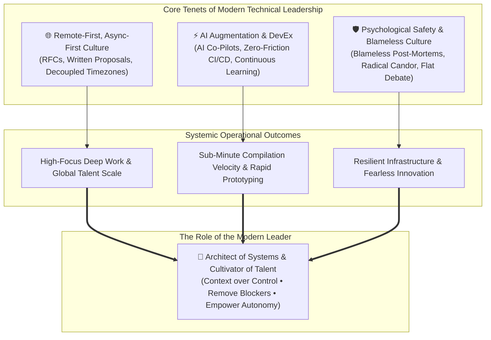

# Leadership Philosophy: Asynchronous Autonomy, AI Augmentation & Psychological Safety
## **Leading High-Velocity Engineering Fleets with Async-First Workflows, Continuous DevEx Investment & Blameless Resilience**

> [!abstract] Executive Summary
> In a modern, distributed engineering organization, effective leadership transcends traditional hierarchies and synchronous oversight. My management philosophy is anchored in **trust, psychological safety, and the strategic application of technology to amplify human potential**. Leading technical teams requires a paradigm shift towards **asynchronous autonomy, AI-augmented workflows, and a relentless focus on outcomes over output**.

---

## 1. Remote-First, Async-First Culture

The future of work is not defined by geographic proximity, but by operational alignment. I champion a remote-first architecture that prioritizes deep work and minimizes synchronous overhead:

* **Asynchronous Communication as the Default**: Meetings are reserved for complex debate, strategy alignment, and interpersonal connection. Status updates, architectural reviews, and daily operations are handled asynchronously through well-documented decision records (ADRs), written Requests for Comments (RFCs), and robust tooling.
* **Outcome-Driven Metrics**: Performance is measured by value delivered, system reliability, and innovation—not hours logged or arbitrary activity metrics.
* **Global Talent Integration**: By decoupling work from specific time zones, we can recruit and integrate the best talent globally, fostering a diverse and resilient team.

---

## 2. AI Augmentation and Developer Experience

Leadership in the AI era means equipping teams with the tools and environment they need to move at the speed of thought:

* **AI as a Force Multiplier**: I advocate for the pervasive integration of AI in the software development lifecycle—from code generation and automated testing to intelligent threat modeling and incident response. This allows engineers to focus on high-value, creative problem-solving.
* **Relentless Focus on Developer Experience (DevEx)**: Friction is the enemy of velocity. I prioritize investments in internal developer platforms, streamlined CI/CD pipelines, and reducing technical debt to ensure a seamless, enjoyable engineering experience.
* **Continuous Learning & Adaptation**: Technology evolves rapidly; so must our teams. I foster a culture of continuous learning, providing dedicated time and resources for upskilling in emerging domains like LLM orchestration, post-quantum cryptography, and advanced automation.

---

## 3. Psychological Safety and Blameless Culture

High-performing teams operate on a foundation of trust. Without psychological safety, innovation stagnates and risks are hidden:

* **Blameless Post-Mortems**: Failures are viewed as systemic learning opportunities, not personal shortcomings. We conduct blameless incident reviews focused on improving processes and preventing recurrence.
* **Radical Candor**: Feedback must be direct, constructive, and delivered with empathy. I encourage open dialogue where every team member feels empowered to challenge the status quo, regardless of their title.
* **Inclusive Decision-Making**: Diverse perspectives yield superior solutions. I actively seek input from all levels of the organization when making strategic architectural or operational decisions, ensuring that the best ideas win.

---

## 4. The Role of the Modern Leader

The modern IT leader is not a taskmaster, but an **architect of systems and a cultivator of talent**. My role is to set clear context, define the strategic vision, remove roadblocks, and empower the team to execute with autonomy and precision. By building resilient, adaptable, and highly motivated teams, we navigate the challenges of tomorrow and drive sustained technological excellence.

---

## 🔗 Related Architecture & Knowledge Graph

* **Production Systems:** Validated in [[Projects/Self_Hosted_CICD_Build_Fleet|Self Hosted CICD Build Fleet]], [[Infra_Audit_Engine|Infra Audit Engine]].
* **Governance & Compliance:** Governed by [[Projects/Governance-and-Policies/Vendor_and_Resource_Management|Vendor and Resource Management]], [[Projects/Governance-and-Policies/Security_Awareness_Training|Security Awareness Training]].
* **Technical Articles:** Deep dive in [[Articles/Architecture/Systems_Automation|Systems and Automation Architecture]].
* **Professional Background:** Authored by Richard P. Dissell ([[Resume/Master_Resume|Master Resume]], [[Resume/Legacy_Roles|Legacy Roles]]).
* **Digital Garden Hub:** Return to the main [[docs/index|Digital Garden Index]].
