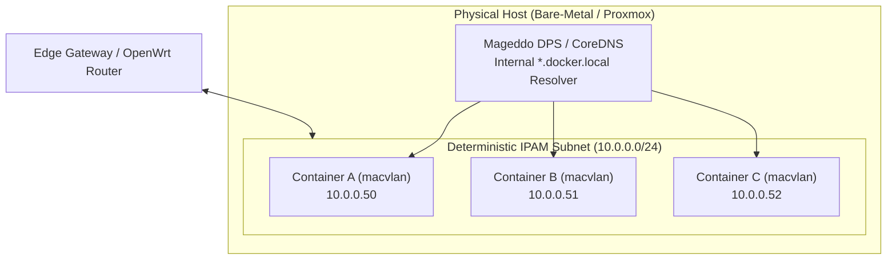
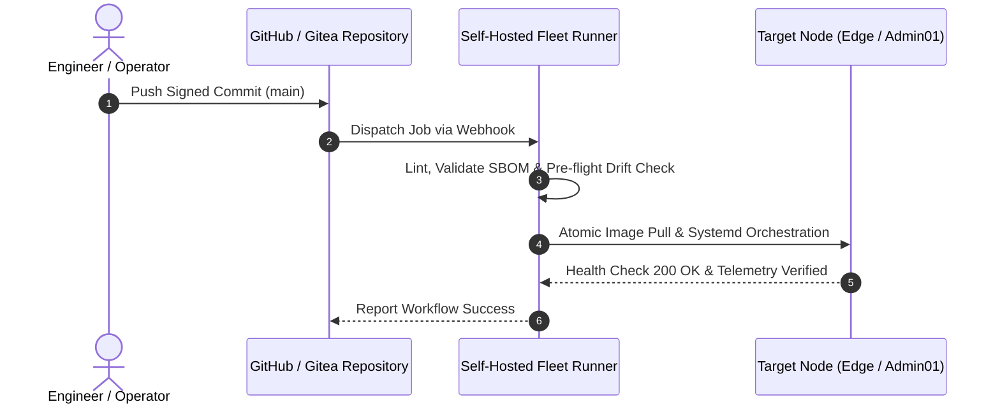

# Systems & Automation Architecture
## **Declarative Orchestration, Layer 2 Virtualization, Hardware-Aware Storage & Immutable GitOps**

> [!abstract] Architectural Thesis
> True infrastructure engineering moves far beyond routine systems administration and manual "click-ops." It requires designing **highly available compute clusters**, **declarative GitOps deployment pipelines**, **Layer 2 non-NAT container networks**, and **hardware-conscious storage tiering** that enforces absolute business continuity through programmatic orchestration and automated drift detection.

---

## 1. Distributed Container Architecture & Non-NAT IPAM

Traditional container deployments rely on Docker's default NAT (Network Address Translation) bridge, creating an unmaintainable "port soup" where distinct services compete for host ports and obscure client IP addresses.

### Layer 2 Virtualization (`macvlan` / `ipvlan`)
- **First-Class Network Citizens**: By assigning dedicated MAC and IP addresses to container interfaces on physical VLANs, services bind to standard default ports (80, 443, 53, 5432) without port mapping collisions.
- **Internal Domain Delegation**: Integrated Mageddo Docker Proxy Server (DPS) and CoreDNS to dynamically register container hostnames into internal `.docker.local` namespaces for automated reverse proxying and zero-trust mutual TLS.

---

## 2. Hardware-Aware Storage Tiering

Modern high-density compute environments must balance disparate I/O demands against underlying physical media limitations:

| Storage Tier | Physical Media | Target Workloads | Rationale & Protection |
| :--- | :--- | :--- | :--- |
| **Tier 1: Hot / High-I/O** | NVMe SSD Arrays | PostgreSQL WAL, Qdrant Vector Indices, Active Container Layers | Maximizes IOPS and eliminates write contention on shared buses. |
| **Tier 2: Warm / Bulk** | Shared NFS & ZFS Storage Pools | DocIngest Corpus, Build Artifacts, Git LFS Bundles | High-capacity cost-effective storage with snapshot parity. |
| **Tier 3: Volatile / Ephemeral** | `tmpfs` (ZRAM) | Temp directories, Router Logs, Runtime PIDs | Protects embedded eMMC flash storage on edge gateways from write-exhaustion. |

---

## 3. Self-Hosted GitOps & CI/CD Pipelines

To eliminate dependency on third-party SaaS availability and secure the software supply chain:

- **Distributed Runner Fleet**: Fleet of self-hosted GitHub Actions runners segmented by architecture (`x86_64` high-compute GPU nodes, `aarch64` embedded SBCs).
- **Automated Firmware Compilation**: Automated compilation of custom OpenWrt firmware utilizing explicit `config.buildinfo` targets and cryptographic image signing.
- **Declarative Drift Mitigation**: Continuous state monitoring against version-controlled manifests, automatically reconciling configuration drift.

---

## 4. Enterprise Virtualization & Disaster Recovery

Architectural reliability requires multi-site fault tolerance and automated recovery procedures:

- **Hypervisor Portability**: Automated conversion and rapid failover pipelines transitioning workloads between VMware vSphere, Microsoft Hyper-V, and Proxmox VE.
- **Enterprise SAN Integration**: Configured and managed high-speed SAN arrays (EMC, Dell EqualLogic, Synology) utilizing multi-path I/O (MPIO) and dedicated iSCSI VLANs.
- **Immutable Air-Gapped Backups**: Enforced Write-Once-Read-Many (WORM) cloud-native and on-premises backup policies with automated periodic restoration verification.

---

## 5. Architectural Synthesis

1. **Decouple the Network**: Eliminate NAT bottlenecks through Layer 2 containerization.
2. **Respect the Hardware**: Optimize filesystem paths to protect media lifecycles and maximize database throughput.
3. **Declare Everything**: Treat infrastructure as versioned, peer-reviewed, and continuously validated software.

---

_Related Documents:_
- **[[Articles/Zero_Trust_Edge_Routing|Zero-Trust Edge Routing & Network Architecture]]**
- **[[Articles/MCP_In_Enterprise_Operations|Model Context Protocol in Enterprise Operations]]**
- **[[Projects/Layer2_Containerization|Layer 2 Virtualization & Non-NAT IPAM Case Study]]**
- **[[Projects/Hardware_Storage_Tiering|Hardware-Aware Storage Tiering Case Study]]**
- **[[Projects/Self_Hosted_CICD_Build_Fleet|Self-Hosted CI/CD Build Fleet]]**
- **[[Projects/Current_Environment|Live Fleet Infrastructure Telemetry]]**

---

## 🔗 Related Architecture & Knowledge Graph

* **Production Systems:** Validated in [[Projects/Infra_Audit_Engine|Infra Audit Engine]], [[Projects/Builder_Manager_OCI_Pipeline|Builder Manager OCI Pipeline]], [[Projects/Unified_Fleet_Observability_Alloy|Unified Fleet Observability Alloy]].
* **Governance & Compliance:** Governed by [[Governance/Policies/IT_Change_Management_Policy|IT Change Management Policy]], [[Governance/Policies/Infrastructure_Hardening_Policy|Infrastructure Hardening Policy]].
* **Technical Articles:** Deep dive in [[Articles/Bare_Metal_Diagnostics_Lessons|Bare Metal Diagnostics Lessons]].
* **Professional Background:** Authored by Richard P. Dissell ([[Resume/Master_Resume|Master Resume]], [[Resume/Legacy_Roles|Legacy Roles]]).
* **Digital Garden Hub:** Return to the main [[index|Digital Garden Index]].
