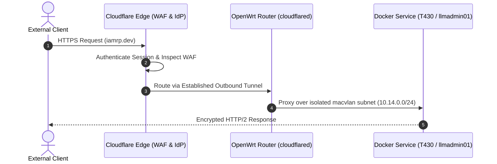

# Zero Trust at the Edge: Hardening OpenWrt with CrowdSec & Cloudflare Tunnels

> [!abstract] Executive Architecture Overview
> Modern network perimeter defense cannot rely on traditional static port-forwarding and basic stateful firewall rules. In this guide, we detail how to architect an OpenWrt-powered border gateway that enforces Zero Trust ingress, automated threat intelligence banning via CrowdSec, and complete isolation of untrusted IoT devices.

---

## 1. The Ingress Paradox: Why Open Ports are Obsolete

For decades, remote access to home and enterprise labs meant forwarding TCP ports (e.g. 80, 443, 22) through the WAN interface to an internal reverse proxy. This exposed internal web servers to automated port scanners, zero-day CVE exploits, and brute-force credential stuffing.

### The Solution: Ingress via Cloudflare Zero Trust Tunnels
By deploying `cloudflared` directly on the gateway:
1. **Zero Open WAN Ports:** All inbound firewall ports on `eth1` (WAN) remain strictly closed (`DROP` policy).
2. **Outbound Encrypted Multiplexing:** The router establishes a resilient HTTP/2/QUIC outbound tunnel to Cloudflare's edge network.
3. **Application Layer Authentication:** Access to internal services (`docingest.iamrp.dev`, `iamrp.dev`, management dashboards) requires authenticated IdP validation (OAuth2/OIDC) before traffic ever reaches the local network.

---

## 2. CrowdSec Intrusion Detection & Local Firewall Bouncer

While tunnels protect external ingress, brute-force attempts on perimeter services (such as SSH honeypots, Telnet traps, and VPN endpoints) require active defensive orchestration.

### The Bouncer Pipeline
* **Log Ingestion:** OpenWrt system logs and container logs are streamed to the CrowdSec parser engine.
* **Community Threat Intelligence:** Banned IPs are evaluated against global consensus signals.
* **Direct Netfilter / nftables Dropping:** The `crowdsec-firewall-bouncer` dynamically injects drop rules directly into the OpenWrt kernel firewall before malicious packets can consume CPU cycles.

---

## 3. Strict VLAN & Subnet Isolation

The local environment is segmented into hard isolation zones:
* **VLAN 10 (`secure`):** Management interfaces, IPMI, out-of-band console access.
* **VLAN 12 (`iot`):** Smart appliances, smart speakers, isolated sensors with zero access to RFC 1918 internal subnets.
* **VLAN 14 (`servers`):** Production Docker hosts, databases, and MCP services with routed Layer 2 connectivity.
* **VLAN 15 (`guest`):** Ephemeral client devices with DNS hijacking and client isolation enabled.

---

## 4. Key Takeaways

1. Never open a port on your WAN interface if an authenticated reverse tunnel can service the request.
2. Pair edge routers with dynamic, behavioral intrusion detection (CrowdSec) to instantly drop malicious scanning noise.
3. Hardware-aware network segmentation (VLANs + macvlan) turns a single physical cable into an audited, multi-tier enterprise network.

---

## 🔗 Related Architecture & Knowledge Graph

* **Production Systems:** Validated in [[Projects/Layer2_Containerization|Layer2 Containerization]], [[Projects/OpenWRT_Blackhole_Webserver|OpenWRT Blackhole Webserver]], [[Projects/Perimeter_Deception_and_Tarpits|Perimeter Deception and Tarpits]], [[Projects/DNS_Forge_Firefox_Addon|DNS Forge Firefox Addon]].
* **Governance & Compliance:** Governed by [[Governance/Policies/Information_Security_Policy|Information Security Policy]], [[Governance/Policies/Infrastructure_Hardening_Policy|Infrastructure Hardening Policy]].
* **Applied Research:** Investigated in [[Research/Security_Analysis_and_Research_Agent/DFIR_and_Playbooks|DFIR and Playbooks]].
* **Professional Background:** Authored by Richard P. Dissell ([[Resume/Master_Resume|Master Resume]]).
* **Digital Garden Hub:** Return to the main [[index|Digital Garden Index]].
