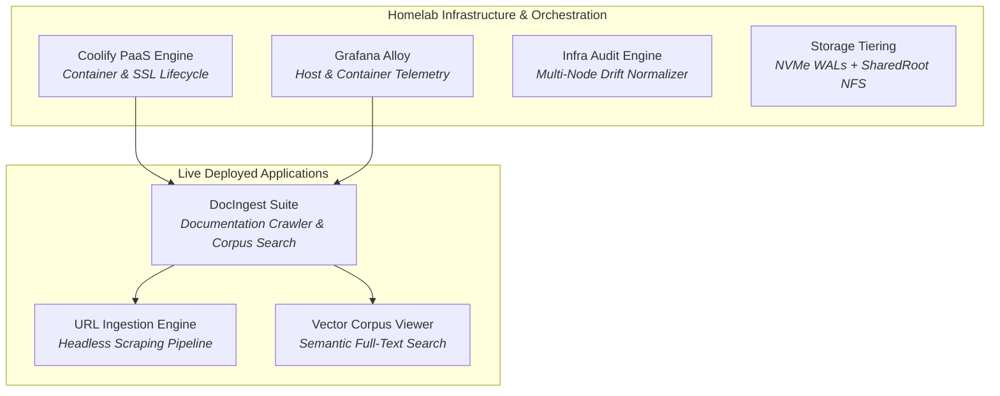

# 🧪 Homelab Projects & Live Applications LIVE LAB SUITE

> **Self-hosted applications, interactive tooling suites, and distributed lab infrastructure running across bare-metal nodes and local container fabrics.**

---

## ⚡ Live Homelab Applications

### 📚 [[Homelab-Projects/DocIngest/index|DocIngest Documentation Suite]]
*High-performance, self-hosted documentation crawler, markdown converter, and semantic corpus browser. Indexes canonical technical documentation and makes it instantly queryable for local Model Context Protocol (MCP) servers and LLM reasoning swarms.*

  <a href="/homelab-projects/docingest/add" class="di-btn di-btn-primary" style="display: inline-flex; padding: 0.6rem 1.25rem; font-weight: 700; text-decoration: none; border-radius: 6px;">
    ⚡ Ingest New Docs (Add)
  </a>
  <a href="/homelab-projects/docingest/view" class="di-btn di-btn-secondary" style="display: inline-flex; padding: 0.6rem 1.25rem; font-weight: 700; text-decoration: none; border-radius: 6px;">
    📚 Browse Corpus (View)
  </a>

- **[[Homelab-Projects/DocIngest/add|DocIngest URL Ingestion]]** (`/homelab-projects/docingest/add`) — *Submit target documentation URLs with inclusion and exclusion path filters to trigger automated web crawling and Markdown distillation.*
- **[[Homelab-Projects/DocIngest/view|DocIngest Corpus Viewer]]** (`/homelab-projects/docingest/view`) — *Full-text search indexed technical libraries, preview Markdown documents, and query the vector corpus.*

---

## 🏛️ Core Homelab Systems & Architectures

Explore the foundational infrastructure hosting these applications under **[[Projects/Homelab/index|Projects > Homelab]]**:

| System / Framework | Description | Architecture Spec |
|---|---|---|
| **[[Projects/Homelab/Coolify|Coolify Self-Hosted PaaS Integration]]** | Internal container and application deployment orchestrator running on the T430 node. | [PaaS Charter](https://iamrp.dev/Projects/Homelab/Coolify) |
| **[[Projects/Homelab/Coolify_Project_Plan|Coolify Multi-Service Staging Plan]]** | Sequenced deployment plan for Netdata, Beszel, Homepage, Directus, and Kestra. | [Staging Plan](https://iamrp.dev/Projects/Homelab/Coolify_Project_Plan) |
| **[[Projects/Homelab/Current_Environment|Current Fleet Environment]]** | Authoritative hardware inventory, CPU architectures, and network routing topology. | [Fleet Topology](https://iamrp.dev/Projects/Homelab/Current_Environment) |
| **[[Projects/Homelab/Hardware_Storage_Tiering|Spatial Hardware-Aware Storage Tiering]]** | ZFS/NVMe/NFS hierarchy routing high-IOPS database transactions to NVMe and media to SharedRoot. | [Storage Spec](https://iamrp.dev/Projects/Homelab/Hardware_Storage_Tiering) |
| **[[Projects/Infrastructure-and-CICD/Infra_Audit_Engine|Infra Audit Engine]]** | Automated Python orchestrator querying bare-metal nodes and compiling `CURRENT_ENV.yml`. | [Audit Engine](https://iamrp.dev/Projects/Infrastructure-and-CICD/Infra_Audit_Engine) |
| **[[Projects/Infrastructure-and-CICD/Unified_Fleet_Observability_Alloy|Unified Fleet Observability (Alloy)]]** | Consolidating container metrics, PSI memory traces, and eBPF network telemetry. | [Observability](https://iamrp.dev/Projects/Infrastructure-and-CICD/Unified_Fleet_Observability_Alloy) |

---

## 🧭 Navigation & Cross-Links
- Return to **[[Projects/index|Engineering & Systems Projects Master Catalog]]**
- Browse the **[[Projects/Homelab/index|Homelab Architecture Overview]]**
- Visit the **[[Wiki/index|Ecosystem Wiki & Knowledge Base]]**
