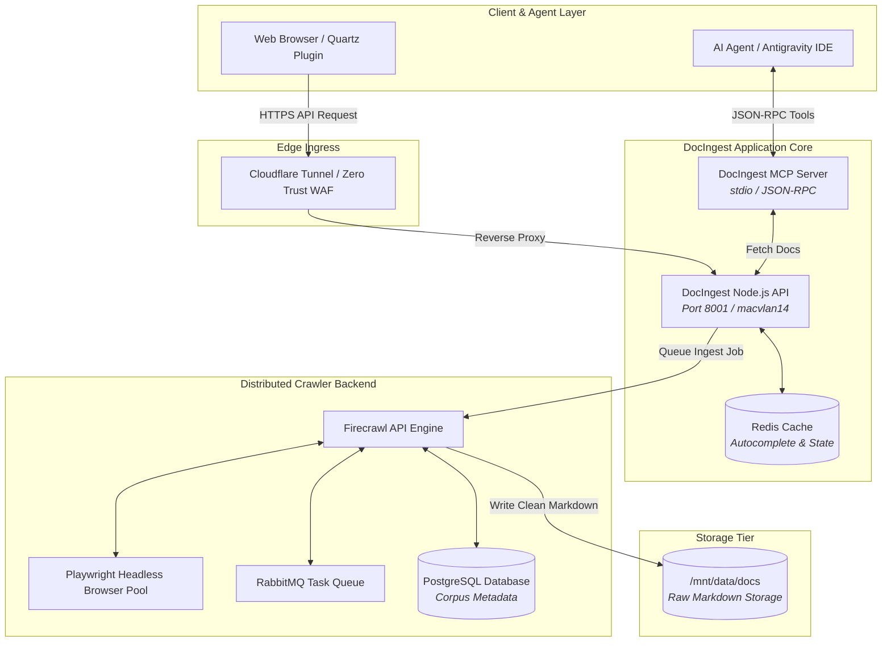

# DocIngest: Distributed Documentation Ingestion Engine

> [!abstract] Engineering Objective
> Large Language Models frequently suffer from severe hallucinations when writing code against bleeding-edge frameworks, custom internal APIs, or rapid version updates. **DocIngest** solves this by autonomously crawling, parsing, cleaning, and indexing complete documentation trees into structured Markdown corpora, exposed to AI agents via the Model Context Protocol (MCP) and web interfaces.

---

### ◈ Live Interactive Demo

Try the DocIngest engine directly within this portfolio:
* **[DocIngest Ingestion Dashboard](Software-&-Github/Tools/DocIngest/add)** — *Dispatch crawler jobs with include/exclude pattern filters.*
* **[DocIngest Corpus Viewer](Software-&-Github/Tools/DocIngest/view)** — *Search, preview, and download indexed documentation libraries.*

---

### ◈ System Architecture

DocIngest is deployed as a decoupled multi-container stack orchestrated via Docker Compose on our T430 cluster:

---

### ◈ Core Components

1. **Firecrawl & Playwright Crawler Pool:**
   * Headless Chromium browser workers bypass single-page app (SPA) hydration hurdles, rendering modern documentation sites (Docusaurus, VitePress, Nextra, MkDocs).
   * Strips tracking scripts, headers, footers, and sidebars, extracting pure semantic Markdown with YAML metadata.

2. **RabbitMQ Task Queue & Redis Rate Limiting:**
   * Regulates crawling concurrency (`MAX_CONCURRENT_JOBS=2`, `BROWSER_POOL_SIZE=2`) to protect local node CPU/RAM resources while respecting origin server rate limits.

3. **Model Context Protocol (MCP) Integration:**
   * Exposes standard tools (`find-docs`, `read-docs`, `query-docs`) enabling AI agents to pull verified documentation into context during coding and auditing sessions.

4. **Quartz Community Plugin (`docingest-quartz`):**
   * Preact-based embeddable component enabling static websites to search, view, and trigger live document crawling from the same interface.
