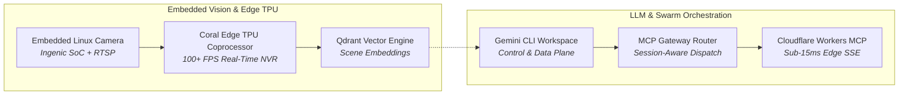

# 🧠 AI Systems, Swarms & Computer Vision

> **Autonomous multi-agent swarms, edge neural inference engines, and low-latency computer vision pipelines engineered for local sovereignty.**

---

## 🏛️ AI & Swarms Projects Portfolio

### 1. [[Projects/AI-and-Swarms/Embedded_Linux_Camera_Firmware|Embedded Linux Camera Firmware & Edge AI Vision]]
*Custom Ingenic SoC Linux kernel firmware, low-latency RTSP streaming pipelines, and on-device scene telemetry feeding Qdrant vector databases for instant semantic search.*

### 2. [[Research/LLM & AI/LLM_Control_Plane|Gemini CLI Workspace: Control & Data Plane Swarm]]
*Decoupled Control Plane (`llm-project`) and Data Plane (`llmdata-core`) orchestrating parallel subagents, task graph execution, and session-scoped memory persistence.*

### 3. [[Research/LLM & AI/MCP_Gateway_Tool_Router|MCP Gateway: Enterprise Model Context Protocol Tool Router]]
*Stateful proxy and aggregator bridging diverse agent runtimes to remote tools via Model Context Protocol with dynamic schema validation and token-budget enforcement.*

### 4. [[Research/LLM & AI/Serverless_Cloudflare_MCP|Serverless Remote MCP on Cloudflare Workers]]
*Edge-native Model Context Protocol server executing tools on Cloudflare's distributed edge network with sub-15ms Server-Sent Events (SSE) streaming.*

### 5. [[Research/LLM & AI/Coral_Edge_TPU_Computer_Vision_NVR|Coral Edge TPU Computer Vision & Low-Latency NVR]]
*Google Coral Edge TPU coprocessor (100+ FPS real-time object detection), WebRTC video brokering via `go2rtc`, and high-efficiency tmpfs RAM buffers.*

### 6. [[Research/LLM & AI/Substrate_Digital_Nervous_System|Substrate — Digital Nervous System]]
*Distributed microservices backbone orchestrating multi-node telemetry, real-time message routing, and automated proactive agent loops.*

---

## 🧭 Navigation & Cross-Links
- Return to **[[Projects/index|All Projects Master Catalog]]**
- Read research papers in **[[Research/index|Security & AI Research Hub]]**
- Explore mobile integration in **[[Projects/Android/index|RPDev Mobile Ecosystem]]**
