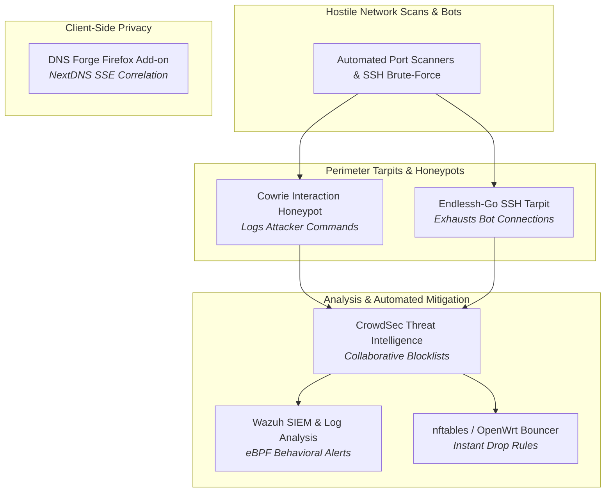

# 🛡️ Defensive Security, SIEM & Threat Deception

> **Collaborative threat defense, active attacker deception, eBPF behavioral detection, and client-side anti-fingerprinting controls.**

---

## 🏛️ Defensive Security Projects Portfolio

### 1. [[Projects/Defensive-Security/Wazuh_CrowdSec_SIEM|Wazuh + CrowdSec Collaborative SIEM]]
*Unified Security Information and Event Management pipeline combining Wazuh's host-level file integrity monitoring with CrowdSec's community-driven attacker IP intelligence.*

### 2. [[Projects/Defensive-Security/Perimeter_Deception_and_Tarpits|Perimeter Deception, Honeypots & SSH Tarpits]]
*Layered deceptive infrastructure deploying Endlessh-Go tarpits and Cowrie honeypots to waste attacker resources and extract real-time indicators of compromise (IOCs).*

### 3. [[Projects/Defensive-Security/DNS_Forge_Firefox_Addon|DNS Forge: NextDNS Firefox Add-on]]
*Manifest V3 browser privacy extension parsing real-time Server-Sent Events (SSE) from NextDNS to detect trackers, analyze query latency, and verify domain blocklists.*

---

## 🧭 Navigation & Cross-Links
- Return to **[[Projects/index|All Projects Master Catalog]]**
- Review hardware key security in **[[Projects/Hardware-Security/index|Hardware Security]]**
- Check firewall and edge routing in **[[Projects/Networking-and-IoT/index|Networking & IoT]]**
