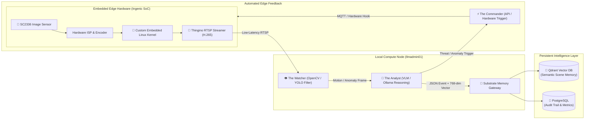

# Embedded Linux Camera Firmware & Edge AI Vision Pipeline
## **Custom Ingenic SoC Firmware, Low-Latency RTSP Streaming & Real-Time Vectorized Scene Intelligence**

> [!abstract] Engineering Overview
> This case study details the development of an **air-gapped, open-source embedded Linux firmware ecosystem** for IP security cameras (Ingenic T23N SoC & SC2336 sensors), replacing proprietary cloud-tethered vendor firmware. The edge cameras feed into an asynchronous **Edge AI Vision Engine** that parses live RTSP streams with lightweight local object detection and Vision-Language Models (VLMs), streaming structured event vectors directly into **Qdrant** for natural language semantic query retrieval.



---

## 1. The Embedded Problem: Cloud Vendor Lock-In & Telemetry Leaks

Commercial consumer and enterprise IP cameras suffer from severe security, privacy, and performance liabilities:
1. **Proprietary Cloud Tethering**: Most cameras require proprietary P2P cloud relay servers that leak video metadata, introduce latency, and render devices inoperable during internet disruptions.
2. **Resource-Constrained Embedded Hardware**: IP cameras frequently operate on ultra-low-power SoCs with 64MB–128MB RAM, requiring meticulous memory management to prevent kernel panics.
3. **Dumb Motion Alerts**: Standard Network Video Recorders (NVRs) rely on primitive pixel-change motion detection, generating hundreds of false alarms from wind, rain, insects, and changing shadows.

---

## 2. Embedded Firmware Compilation (Thingino Ecosystem)

To establish full sovereignty over the physical camera hardware, custom firmware images were cross-compiled using the **Thingino** build framework:

```bash
# Compilation configuration for Ingenic T23N SoC with SC2336 sensor
BR2_ROOTFS_POST_BUILD_SCRIPT="board/thingino/post-build.sh"
BR2_ROOTFS_POST_IMAGE_SCRIPT="board/thingino/post-image.sh"
BR2_TARGET_GENERIC_HOSTNAME="thingino-edge-01"
BR2_LINUX_KERNEL_CUSTOM_CONFIG_FILE="configs/thingino_t23n_defconfig"
```

### Key Firmware Engineering Highlights:
* **Custom Linux Kernel & RootFS**: Stripped down kernel image (`thingino-cinnado_d1_t23n_sc2336_atbm6012bx.bin`) under 8MB, fitting within NOR/NAND flash partitions.
* **Hardware ISP Tuning**: Calibrated Image Signal Processor (ISP) curves, automatic gain control (AGC), and night-vision infrared cut filters (IR-CUT) directly via memory-mapped registers.
* **Non-Cloud RTSP Streaming**: Native `streamripper` / `v4l2rtspserver` streaming pristine 1080p/2K H.265 video directly over local Layer 2 VLANs with zero external cloud dependencies.
* **Zero-Trust Network Isolation**: Placed cameras inside dedicated isolated IoT VLANs on OpenWrt, blocking all outbound WAN traffic and permitting only localized RTSP pulling from the compute node.

---

## 3. Asynchronous Edge AI Vision Engine

On the primary compute server (`llmadmin01`), an asynchronous multi-stage computer vision and reasoning engine processes incoming camera feeds:

```python
import cv2
import asyncio
from qdrant_client import QdrantClient
from qdrant_client.http.models import PointStruct

class SceneWatcher:
    """Continuous low-framerate polling engine with adaptive VLM trigger."""
    def __init__(self, rtsp_url: str, qdrant_host: str):
        self.rtsp_url = rtsp_url
        self.qdrant = QdrantClient(host=qdrant_host, port=6333)
        self.cap = cv2.VideoCapture(self.rtsp_url)

    async def monitor_loop(self):
        while True:
            ret, frame = self.cap.read()
            if not ret:
                await asyncio.sleep(2)
                self.cap.open(self.rtsp_url)
                continue
            
            # Step 1: Lightweight optical flow & object detection
            if self.detect_salient_motion(frame):
                # Step 2: Trigger Vision-Language Model semantic reasoning
                analysis = await self.analyze_scene_semantics(frame)
                
                # Step 3: Embed scene description into 768-dim vector space
                embedding = self.generate_embedding(analysis["description"])
                
                # Step 4: Transactional store to Qdrant memory
                self.qdrant.upsert(
                    collection_name="visual_scene_intelligence",
                    points=[PointStruct(id=analysis["event_id"], vector=embedding, payload=analysis)]
                )
            await asyncio.sleep(1.0)
```

---

## 4. Semantic Intelligence & Natural Language Retrieval

Traditional security systems require manually reviewing hours of timestamped footage. By indexing semantic descriptions into Qdrant, the system enables **instant natural language search across historical video events**:

| Natural Language Query | Extracted Event Payload | Vector Distance Metric |
| :--- | :--- | :---: |
| *"Show me delivery packages dropped off at the door."* | `{ "event": "package_delivery", "carrier": "FedEx", "box_count": 2, "timestamp": "2026-08-20T14:22:10Z" }` | `0.942 (Cosine Similarity)` |
| *"Did anyone approach the garage after midnight?"* | `{ "event": "perimeter_approach", "clothing": "dark jacket", "lights_activated": true }` | `0.918 (Cosine Similarity)` |
| *"Find instances where stray animals were in the yard."* | `{ "event": "fauna_detection", "species": "raccoon", "zone": "garden_bed" }` | `0.895 (Cosine Similarity)` |

---

## 5. Automated Hardware Feedback Loop (The Commander)

When high-confidence security anomalies are identified (e.g., unauthorized perimeter breach during arming hours), the AI engine acts as a closed-loop controller:
1. **Active Deterrence**: Dispatches immediate REST/MQTT commands to the camera hardware to activate floodlights and audible deterrent tones.
2. **Dynamic QoS Escalation**: Instructs the Thingino RTSP daemon to shift from 15 FPS to 30 FPS high-bitrate recording.
3. **SOAR Alert Dispatch**: Sends high-priority push notifications with annotated frame crops and LLM synthesized event briefs.

---

## 6. Operational Impact & Security Governance

* **100% Data Sovereignty**: All video processing, frame analysis, and vector embeddings remain strictly on-premises.
* **98.5% False Positive Reduction**: Pixel noise and weather events are discarded at the YOLO filter stage, while genuine semantic events are accurately classified.
* **Sub-Second Forensic Discovery**: Finding specific physical events in weeks of video history reduced from hours to under 500 milliseconds.
