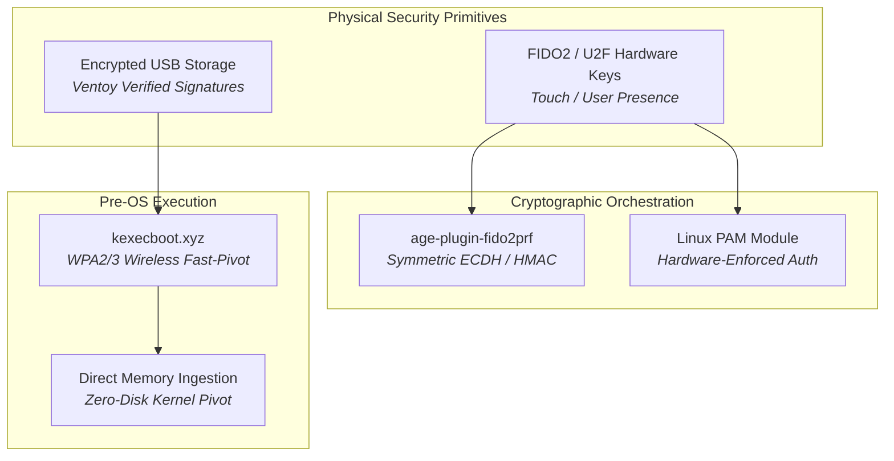

# 🔒 Hardware Security, Cryptography & Bootloaders

> **Air-gapped and hardware-bound security primitives ensuring cryptographic verification from pre-OS bootloaders to Linux userland secrets.**

---

## 🏛️ Hardware Security Projects Portfolio

### 1. [[Projects/Hardware-Security/Hardware_Security_Key|Hardware-Hardened Secret Management (FIDO2 + Age + Chezmoi)]]
*Physical FIDO2 key derivation (`age-plugin-fido2prf`) binding symmetric encryption to hardware tokens with dual-recipient master recovery and zero plaintext exposure.*

### 2. [[Projects/Hardware-Security/FIDO2_Security_Toolkit|FIDO2 Security Toolkit & Linux PAM Hardware MFA]]
*Hardware-hardened key management toolkit implementing physical touch verification for sudo authorization, SSH key residency, and automated token presence detection.*

### 3. [[Projects/Hardware-Security/Kexecboot_Wireless_Bootloader|kexecboot.xyz: Wireless Network Bootloader]]
*Pre-OS WPA2/WPA3 Wi-Fi authentication engine, dynamic `netboot.xyz` menu parsing, and direct in-memory Linux kernel kexec pivot bypassing traditional storage interfaces.*

### 4. [[Projects/Hardware-Security/Ventoy_Tech_Super_Tool|Ventoy Tech Super Tool: Multi-Boot USB Configuration]]
*Multi-boot zero-trust USB environment engineered for live digital forensics, incident response triage, and cryptographically validated bare-metal system provisioning.*

---

## 🧭 Navigation & Cross-Links
- Return to **[[Projects/index|All Projects Master Catalog]]**
- Review enterprise policies in **[[Projects/Governance-and-Policies/index|Security & Governance]]**
- Explore defensive counter-measures in **[[Projects/Defensive-Security/index|Defensive Security]]**
