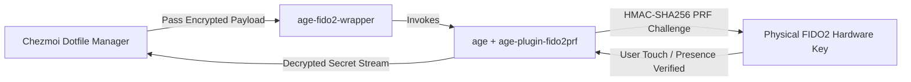

# Hardware-Hardened Secret Management: FIDO2 + Age + Chezmoi
## **Physical Token HMAC-SHA256 PRF Key Derivation, Dual-Recipient Encryption & Zero Plaintext Persistence**

> [!abstract] Architectural Goal
> In a multi-machine development and server environment, storing private credentials, SSH keys, and API tokens in unencrypted dotfiles is an unacceptable security risk. This architecture enforces hardware-bound secret encryption using physical FIDO2/U2F security tokens paired with `age-plugin-fido2prf` and Chezmoi orchestration.

---

## 1. Core Cryptographic Design Principles

1. **Symmetric Identity Binding:**
   * Uses `age-plugin-fido2prf` to derive symmetric encryption keys directly from the hardware token's internal secure element (`/dev/hidraw1`).

2. **Dual-Recipient Master Recovery Scheme:**
   * Every file is encrypted to both the physical FIDO2 hardware identity AND an air-gapped Master Recovery Key (`age-master-recovery.txt`).
   * Prevents total infrastructure lockout in the event of hardware loss while maintaining zero persistent plaintext secrets on disk.

3. **Encrypted Diffing via `textconv`:**
   * Configures `chezmoi.toml` with custom `textconv` filters to inspect secret changes and Git diffs in memory without writing decrypted credentials to persistent disk partitions.
