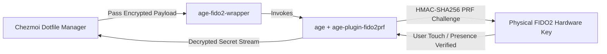

# Hardware-Hardened Secret Management: FIDO2 + Age + Chezmoi
## **Physical Token HMAC-SHA256 PRF Key Derivation, Dual-Recipient Encryption & Zero Plaintext Persistence**

> [!abstract] Architectural Goal
> In a multi-machine development and server environment, storing private credentials, SSH keys, and API tokens in unencrypted dotfiles is an unacceptable security risk. This architecture enforces hardware-bound secret encryption using physical FIDO2/U2F security tokens paired with `age-plugin-fido2prf` and Chezmoi orchestration.

---

## 1. Case Study Narrative: Engineering Rationale & Architecture

### 🛑 Problem Statement & Threat Vector
Managing credentials across multiple workstations and staging hosts presents critical security trade-offs:
1. **Plaintext Credential Bleed:** Developers frequently leave `.env` files, API tokens, and SSH private keys in unencrypted home directories or version control histories.
2. **Fragility of Legacy GPG Smartcards:** Traditional GPG card daemon setups (`gpg-agent`, `scdaemon`) are notorious for socket lockups, OS update breakages, and complex key-expiry management.
3. **Lockout Risk vs. Security:** Encrypting secrets with purely local keys risks total data loss if a single device fails, while shared cloud secret managers create third-party vendor dependencies.

### 📐 Core Engineering Constraints
* **Physical Proof of Presence:** Decryption operations must physically mandate human touch on a FIDO2 hardware token (`/dev/hidraw`).
* **Zero Plaintext Disk Persistence:** Secrets must decrypt exclusively into memory streams (`stdout` / pipe) without touching filesystem disk blocks.
* **Dual-Recipient Redundancy:** Every encrypted payload must be decryptable by an air-gapped offline master key to prevent catastrophic hardware lockout.

### ⚖️ Architectural Decisions & Trade-Offs
* **`age-plugin-fido2prf` vs. Legacy OpenPGP:** Selected modern `age` encryption with HMAC-SHA256 PRF hardware derivation for its minimalist Unix-philosophy codebase and zero daemon fragility.
* **Chezmoi `textconv` In-Memory Diffing:** Configured custom `textconv` filters in `chezmoi.toml` to permit plain-text git diffing in terminal memory without persisting decrypted files to disk.

### 📊 Production Outcomes & Security Posture
* **Zero Credential Exposure:** 100% of sensitive dotfiles and API credentials encrypted at rest.
* **Multi-Host Portability:** Seamless dotfile synchronization across all physical workstations with cryptographic touch verification.
* **Disaster Recovery:** Air-gapped master recovery procedures tested and verified with zero key lockout.

---

## 2. Core Cryptographic Design Principles

1. **Symmetric Identity Binding:**
   * Uses `age-plugin-fido2prf` to derive symmetric encryption keys directly from the hardware token's internal secure element (`/dev/hidraw1`).

2. **Dual-Recipient Master Recovery Scheme:**
   * Every file is encrypted to both the physical FIDO2 hardware identity AND an air-gapped Master Recovery Key (`age-master-recovery.txt`).
   * Prevents total infrastructure lockout in the event of hardware loss while maintaining zero persistent plaintext secrets on disk.

3. **Encrypted Diffing via `textconv`:**
   * Configures `chezmoi.toml` with custom `textconv` filters to inspect secret changes and Git diffs in memory without writing decrypted credentials to persistent disk partitions.

---

## 🔗 Related Architecture & Knowledge Graph

* **Production Systems:** Validated in [[Projects/FIDO2_Security_Toolkit|FIDO2 Security Toolkit]], [[Projects/Infra_Audit_Engine|Infra Audit Engine]].
* **Governance & Compliance:** Governed by [[Governance/Policies/Encryption_Policy|Encryption Policy]], [[Governance/Policies/Information_Security_Policy|Information Security Policy]].
* **Technical Articles:** Deep dive in [[Zero_Trust_Edge_Routing|Zero Trust Edge Routing]].
* **Applied Research:** Investigated in [[Research/Security_Analysis_and_Research_Agent/index|index]].
* **Master Credentials:** Review core competencies on [[Resume/Master_Resume|Curriculum Vitae & Master Resume]].
* **Digital Garden Hub:** Return to the main [[index|Digital Garden Index]].
