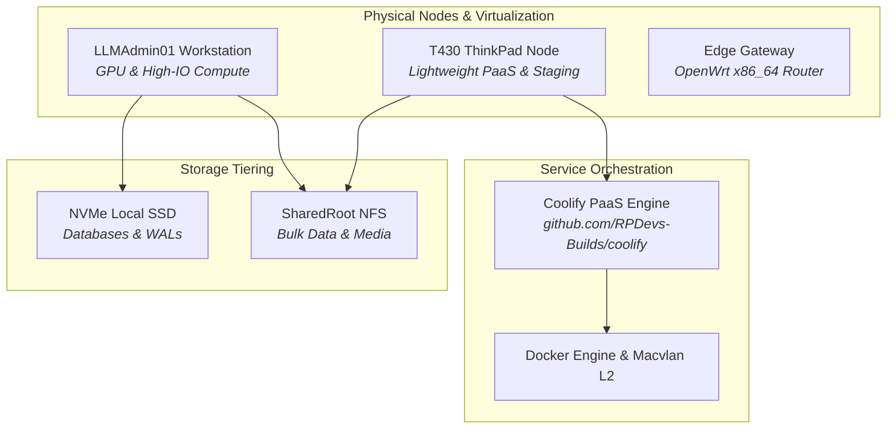

# 🧪 Homelab Infrastructure: Bare-Metal, PaaS & Hybrid Cloud

> **Heterogeneous bare-metal and hybrid compute infrastructure powering production workloads, development sandboxes, and automated self-hosted services.**

---

## 🏛️ Homelab Projects Portfolio

### 1. [[Projects/Homelab/Coolify|Coolify Self-Hosted PaaS Integration]]
*Centralized application and container deployment engine deployed under `RPDevs-Builds/coolify`. Acts as an internal orchestration layer anchored to the T430 node to manage web services, databases, and microservices with automated SSL lifecycle management.*

### 2. [[Projects/Homelab/Coolify_Project_Plan|Coolify Implementation & Staging Plan]]
*Sequenced rollout plan detailing environment prep, reverse proxy configuration, resource baselines, Netdata vs Beszel benchmarking, Homepage dashboard consolidation, and Directus/Kestra orchestration.*

### 3. [[Projects/Homelab/Current_Environment|Current Fleet Environment & Node Topology]]
*The single source of truth documenting hardware specifications, CPU topologies, memory limits, storage partitions, and network routing configurations across all physical and virtual nodes.*

### 4. [[Projects/Homelab/Hardware_Storage_Tiering|Spatial Hardware-Aware Storage Tiering]]
*ZFS, NVMe, and NFS storage hierarchy optimizing write amplification and throughput by routing high-IOPS database transactions and write-ahead logs to NVMe while streaming static assets and backups to SharedRoot.*

---

## 🧭 Navigation & Cross-Links
- Return to **[[Projects/index|All Projects Master Catalog]]**
- Explore monitoring in **[[Projects/Infrastructure-and-CICD/index|Infrastructure & CI/CD]]**
- Review hardware key management in **[[Projects/Hardware-Security/index|Hardware Security]]**
