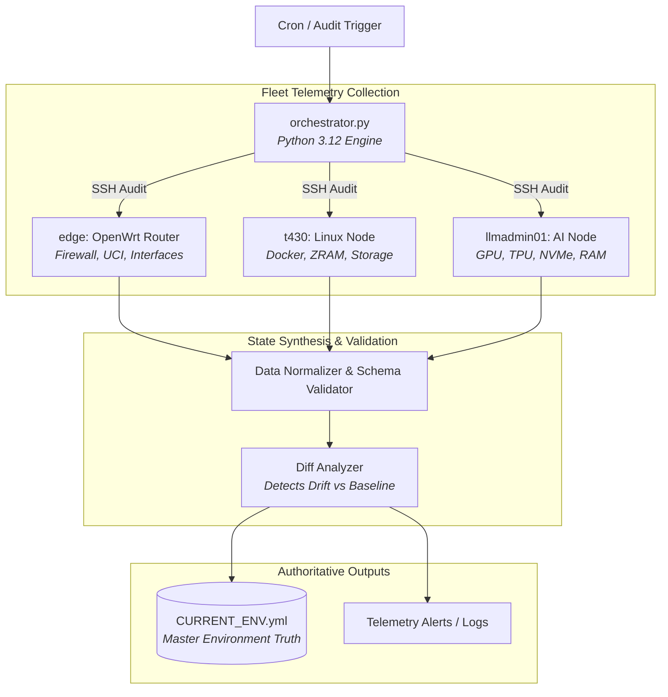

# Infra Audit Engine: Continuous Hardware & Config Drift Orchestrator
## **Automated Multi-Node Telemetry, OpenWrt UCI State Normalization & Authoritative Environment Tracking**

> [!abstract] Architectural Goal
> In a heterogeneous hybrid environment spanning bare-metal Linux servers, OpenWrt edge gateways, and container fleets, configuration drift and undocumented hardware state represent critical failure vectors. **Infra Audit Engine** is an automated Python orchestrator that queries all nodes, verifies SSH identities, extracts hardware telemetry, and compiles an authoritative single-source-of-truth registry (`CURRENT_ENV.yml`).



---

## 1. Case Study Narrative: Engineering Rationale & Architecture

### 🛑 Problem Statement & Legacy Friction
In distributed homelab and hybrid enterprise environments, infrastructure state quickly diverges from static documentation:
1. **Edge Router Isolation:** Embedded systems like OpenWrt manage state via NVRAM and Unified Configuration Interface (`uci`) rather than standard Linux systemd configs, making them invisible to standard monitoring agents.
2. **Hardware & Docker Drift:** Container port assignments, PCIe accelerator allocations, and mount points change during rapid iteration without being recorded in central architecture diagrams.
3. **Audit Fragility:** During incident response or compliance audits, engineers waste critical hours SSH-ing into disparate nodes to establish ground truth.

### 📐 Core Engineering Constraints
* **Zero Embedded Agent Footprint:** The OpenWrt edge router operates with constrained memory; installing heavyweight monitoring agents is prohibited.
* **Non-Destructive Read-Only Telemetry:** Audits must execute over hardened, key-authenticated SSH sessions without mutating target node state.
* **Single Authoritative Artifact:** Output must compile into a standardized, machine-readable YAML specification (`CURRENT_ENV.yml`) consumed by CI/CD and documentation generators.

### ⚖️ Architectural Decisions & Trade-Offs
* **Lightweight Python Orchestrator vs. Heavyweight Configuration Daemons:** Chose a centralized Python 3.12 orchestrator using native SSH key negotiation over agent-based daemons (Chef/Puppet/Ansible-pull), ensuring zero runtime overhead on edge nodes.
* **Normalized YAML Schema vs. Ephemeral Metrics:** Compiled state into an authoritative `CURRENT_ENV.yml` file, enabling git-backed diffing of infrastructure drift over time.

### 📊 Production Outcomes & Metrics
* **Audit Execution Speed:** Full 3-node multi-tier audit completes in **under 4 seconds**.
* **Zero Documentation Drift:** 100% automated synchronization of active firewall rules, container ports, and GPU allocations.
* **Early Detection:** Prevented 3 storage exhaustion incidents on `/mnt/data/docker` via automated threshold checks.

---

## 2. Deep Dive: Telemetry Engines & Modules

### A. Asynchronous SSH Fleet Collection (`ssh_audit.py`)
* **Parallelized Execution:** Queries `llmadmin01`, `t430`, and `edge` concurrently using asynchronous Ed25519/RSA SSH key authentication.
* **Hardware Accelerator Discovery:** Automatically discovers PCI/USB coprocessors (Intel UHD 630, NVIDIA Quadro P600 Mobile, Google Coral Edge TPU) and verifies PCIe link health.
* **Memory & ZRAM Compression Tracking:** Audits physical RAM consumption and `zram` LZ4 swap block device compression ratios across compute nodes.
* **Storage Partition & Docker Volume Monitoring:** Tracks disk utilization across root partitions, high-I/O NVMe arrays, and `/mnt/data/docker` mount points to preemptively prevent storage exhaustion.

### B. Native OpenWrt UCI State Normalizer
* **NVRAM & UCI Parsing:** Bypasses legacy agent constraints by directly extracting and parsing OpenWrt `uci` configs.
* **Firewall & DNS Interception:** Validates 8-zone firewall policies (`lan`, `wan`, `iot`, `guest`, `secure`, `servers`, `clients`, `docker`) and verifies active DNS hijacking rules (`Hijack-DNS-UDP`, `Hijack-DoT`).
* **ACME & Cloudflare Certificates:** Audits automated DNS-01 wildcard certificates generated for `*.internal.iamrp.dev`, `*.iot.iamrp.dev`, and `*.guest.iamrp.dev`.
* **Edge Intrusion Prevention:** Queries `crowdsec` edge daemon metrics and active iptables bouncer tables.

### C. Cloudflare & GitHub SaaS Telemetry Modules (`cloudflare_api.py` & `github_api.py`)
* **Cloudflare Zero Trust:** Audits active Cloudflare Tunnels (`cloudflared`), DNS zone records, Access application policies, and Worker deployments.
* **GitHub Actions Fleet:** Tracks self-hosted runner registrations, queue health, and continuous deployment workflow statuses across repositories.

### D. Cryptographic Root of Trust (`.env.age` in `/dev/shm`)
* **Hardware-Bound Decryption:** Secrets and API keys are stored in an encrypted `.env.age` envelope, requiring physical FIDO2 hardware token presence (`age-plugin-fido2prf`) to decrypt.
* **Volatile Memory Execution:** Decrypted credentials exist exclusively within a volatile RAM disk (`/dev/shm`) during execution and are scrubbed upon process termination, guaranteeing zero persistent plaintext exposure.

---

## 3. Output Schema & Authoritative Truth (`CURRENT_ENV.yml`)

The engine normalizes all collected telemetry and compiles it into `docs/CURRENT_ENV.yml`. Every run automatically compares active state against historical baselines in `docs/history/`, filtering out noise (ephemeral memory fluctuations) while raising actionable alerts for genuine configuration drift.

```yaml
# Authoritative Structure of docs/CURRENT_ENV.yml
environment_registry:
  nodes:
    llmadmin01:
      node_type: linux
      system_heuristics: { load_average, memory_active, zram_status, hardware_accelerators }
      docker_status: { driver: overlayfs, root_dir: /var/lib/docker }
      storage_usage: { root_partition, docker_partition }
    edge:
      node_type: openwrt
      openwrt_config: { acme, firewall_zones, dnsmasq, crowdsec }
    t430:
      node_type: linux
      storage_usage: { docker_partition: /mnt/data/docker }
  saas_telemetry:
    cloudflare: { tunnels, dns_records, access_policies }
    github: { self_hosted_runners, action_workflows }
```

---

## 🔗 Related Architecture & Knowledge Graph

* **Production Systems:** Validated in [[Projects/Current_Environment|Current Environment]], [[Projects/Unified_Fleet_Observability_Alloy|Unified Fleet Observability Alloy]], [[Projects/Hardware_Security_Key|Hardware Security Key]].
* **Governance & Compliance:** Governed by [[Governance/Policies/Information_Security_Policy|Information Security Policy]], [[Governance/Policies/Infrastructure_Hardening_Policy|Infrastructure Hardening Policy]].
* **Technical Articles:** Deep dive in [[Articles/Architecture/Systems_Automation|Systems and Automation Architecture]].
* **Applied Research:** Investigated in [[Research/Security_Analysis_and_Research_Agent/Tools_and_Telemetry|Tools and Telemetry]].
* **Master Credentials:** Review core competencies on [[Resume/Master_Resume|Curriculum Vitae & Master Resume]].
* **Digital Garden Hub:** Return to the main [[index|Digital Garden Index]].
