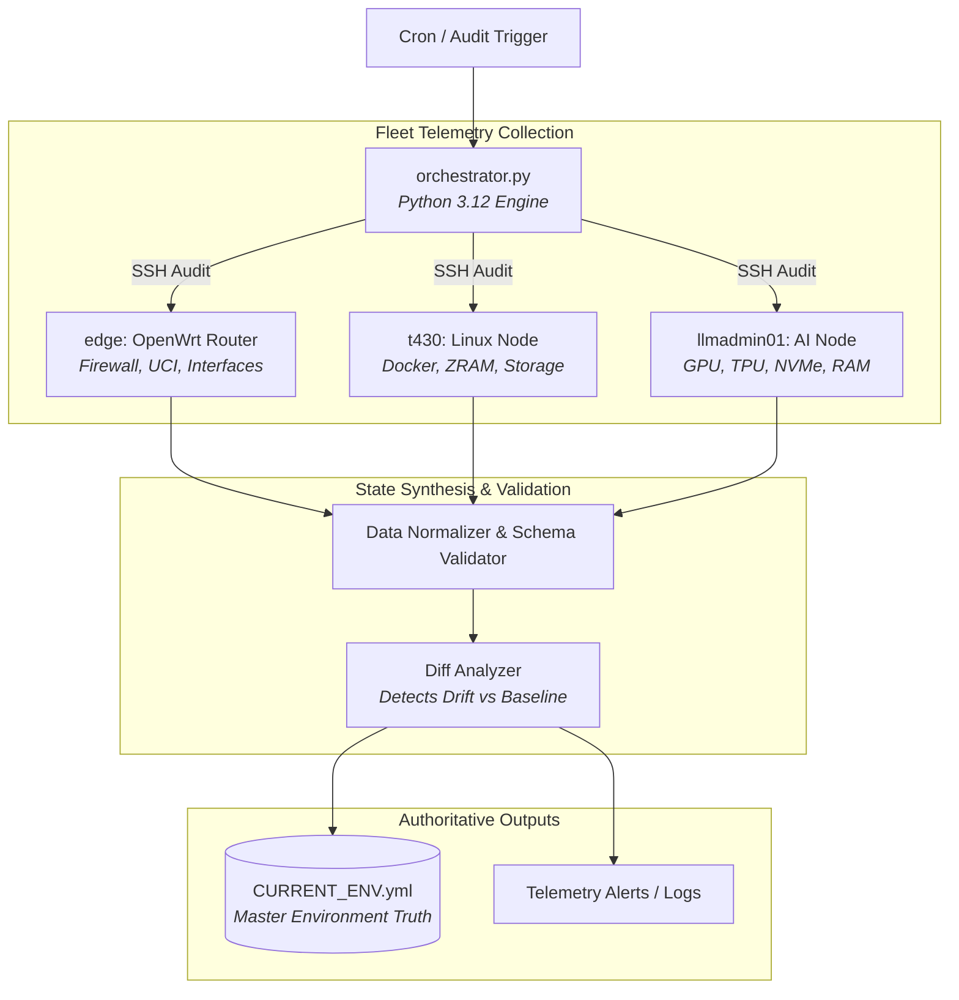

# Infra Audit Engine: Continuous Hardware & Config Drift Orchestrator
## **Automated Multi-Node Telemetry, OpenWrt UCI State Normalization & Authoritative Environment Tracking**

> [!abstract] Architectural Goal
> In a heterogeneous hybrid environment spanning bare-metal Linux servers, OpenWrt edge gateways, and container fleets, configuration drift and undocumented hardware state represent critical failure vectors. **Infra Audit Engine** is an automated Python orchestrator that queries all nodes, verifies SSH identities, extracts hardware telemetry, and compiles an authoritative single-source-of-truth registry (`CURRENT_ENV.yml`).

---

## 1. Case Study Narrative: Engineering Rationale & Architecture

### 🛑 Problem Statement & Legacy Friction
In distributed homelab and hybrid enterprise environments, infrastructure state quickly diverges from static documentation:
1. **Edge Router Isolation:** Embedded systems like OpenWrt manage state via NVRAM and Unified Configuration Interface (`uci`) rather than standard Linux systemd configs, making them invisible to standard monitoring agents.
2. **Hardware & Docker Drift:** Container port assignments, PCIe accelerator allocations, and mount points change during rapid iteration without being recorded in central architecture diagrams.
3. **Audit Fragility:** During incident response or compliance audits, engineers waste critical hours SSH-ing into disparate nodes to establish ground truth.

### 📐 Core Engineering Constraints
* **Zero Embedded Agent Footprint:** The OpenWrt edge router operates with constrained memory; installing heavyweight monitoring agents is prohibited.
* **Non-Destructive Read-Only Telemetry:** Audits must execute over hardened, key-authenticated SSH sessions without mutating target node state.
* **Single Authoritative Artifact:** Output must compile into a standardized, machine-readable YAML specification (`CURRENT_ENV.yml`) consumed by CI/CD and documentation generators.

### ⚖️ Architectural Decisions & Trade-Offs
* **Lightweight Python Orchestrator vs. Heavyweight Configuration Daemons:** Chose a centralized Python 3.12 orchestrator using native SSH key negotiation over agent-based daemons (Chef/Puppet/Ansible-pull), ensuring zero runtime overhead on edge nodes.
* **Normalized YAML Schema vs. Ephemeral Metrics:** Compiled state into an authoritative `CURRENT_ENV.yml` file, enabling git-backed diffing of infrastructure drift over time.

### 📊 Production Outcomes & Metrics
* **Audit Execution Speed:** Full 3-node multi-tier audit completes in **under 4 seconds**.
* **Zero Documentation Drift:** 100% automated synchronization of active firewall rules, container ports, and GPU allocations.
* **Early Detection:** Prevented 3 storage exhaustion incidents on `/mnt/data/docker` via automated threshold checks.

---

## 2. Key Telemetry Capabilities

1. **Hardware Accelerator Discovery:**
   * Catalogs PCI/USB accelerators (Intel UHD 630, NVIDIA Quadro P600, Google Coral Edge TPU).
   * Monitors real-time PCIe link status and driver health.

2. **Memory & Compressed Swap Telemetry:**
   * Tracks active physical RAM alongside transparent `zram` compressed memory utilization across nodes.

3. **OpenWrt UCI Configuration Parsing:**
   * Scans firewall zones, DNS interception redirect rules (`Hijack-DNS-UDP`, `Hijack-DoT`), and CrowdSec bouncer metrics directly from edge router NVRAM.

4. **Storage Partition & Flash Health Monitoring:**
   * Monitors disk utilization across root partitions, high-I/O NVMe arrays, and `/mnt/data/docker` mount points.

---

## 🔗 Related Architecture & Knowledge Graph

* **Production Systems:** Validated in [[Projects/Current_Environment|Current Environment]], [[Projects/Unified_Fleet_Observability_Alloy|Unified Fleet Observability Alloy]], [[Projects/Hardware_Security_Key|Hardware Security Key]].
* **Governance & Compliance:** Governed by [[Governance/Policies/Information_Security_Policy|Information Security Policy]], [[Governance/Policies/Infrastructure_Hardening_Policy|Infrastructure Hardening Policy]].
* **Technical Articles:** Deep dive in [[Articles/Systems_and_Automation_Architecture|Systems and Automation Architecture]].
* **Applied Research:** Investigated in [[Research/Security_Analysis_and_Research_Agent/Tools_and_Telemetry|Tools and Telemetry]].
* **Master Credentials:** Review core competencies on [[Resume/Master_Resume|Curriculum Vitae & Master Resume]].
* **Digital Garden Hub:** Return to the main [[index|Digital Garden Index]].
