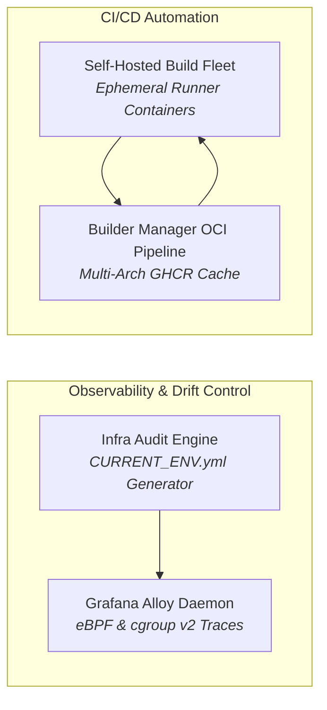

# 📊 Distributed Infrastructure, Telemetry & CI/CD Pipelines

> **Automated infrastructure lifecycle, configuration drift reconciliation, kernel-level eBPF metrics, and scalable OCI build engines.**

---

## 🏛️ Infrastructure & CI/CD Projects Portfolio

### 1. [[Projects/Infrastructure-and-CICD/Infra_Audit_Engine|Infra Audit Engine: Continuous Drift Orchestrator]]
*Automated Python orchestrator querying bare-metal hosts, OpenWrt routers, and Docker daemons to detect configuration drift and compile authoritative `CURRENT_ENV.yml` state files.*

### 2. [[Projects/Infrastructure-and-CICD/Unified_Fleet_Observability_Alloy|Unified Fleet Observability: Grafana Alloy & eBPF]]
*Consolidating host-level CPU/memory, container PSI metrics, and kernel eBPF network traces into centralized Prometheus and Loki dashboards via Grafana Alloy.*

### 3. [[Projects/Infrastructure-and-CICD/Self_Hosted_CICD_Build_Fleet|Self-Hosted CI/CD Build Fleet]]
*Scalable, hardened GitHub Actions self-hosted runner infrastructure executing heavy compilation jobs, multi-platform image builds, and automated unit testing.*

### 4. [[Projects/Infrastructure-and-CICD/Builder_Manager_OCI_Pipeline|Builder Manager: Multi-Arch OCI & Cache Engine]]
*Automated Docker build engine supporting `linux/amd64` and `linux/arm64` cross-compilation with distributed layer caching, GHCR publishing, and automatic retention cleanup.*

---

## 🧭 Navigation & Cross-Links
- Return to **[[Projects/index|All Projects Master Catalog]]**
- Review host inventory in **[[Projects/Homelab/Current_Environment|Current Environment]]**
- Explore defensive logging in **[[Projects/Defensive-Security/index|Defensive Security]]**
