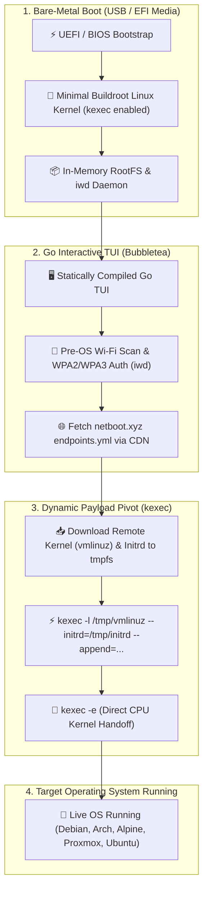
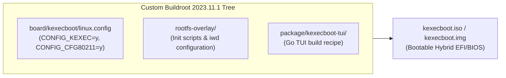
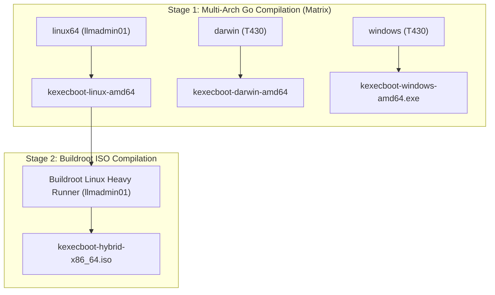

# kexecboot.xyz: Wireless Network Bootloader & kexec Pivot Engine
## **Bypassing UEFI iPXE Limitations with Buildroot Linux, Statically Compiled Go TUI & Dynamic Kernel Handoffs**

> [!abstract] Architectural Overview
> **kexecboot.xyz** is a bare-metal network bootloader designed to eliminate the physical constraints of traditional PXE and iPXE environments. Combining a minimal Buildroot Linux initramfs with a statically compiled Go terminal interface (Bubbletea TUI), the system enables **pre-OS WPA2/WPA3 Wi-Fi authentication**, dynamically synchronizes with remote OS registries (`netboot.xyz`), and executes a direct in-memory CPU pivot into target operating systems using Linux **`kexec`**.



---

## 1. The Core Limitation of Traditional Network Booting

For decades, network booting relied on Preboot Execution Environment (PXE) and iPXE firmware standards. However, deploying bare-metal operating systems over modern networks faces severe architectural limitations:

1. **Lack of Wireless Security Support**: Standard UEFI Simple Network Protocol (SNP) and iPXE drivers lack WPA2/WPA3-Enterprise supplicants and cryptographic wireless handshakes. Network booting historically required dedicated physical Cat6 ethernet cables.
2. **Firmware NIC Incompatibilities**: Proprietary UEFI network stacks frequently lack modern drivers for cutting-edge Intel, Realtek, and Qualcomm Wi-Fi chipsets.
3. **Fragile Chainloading**: Traditional PXE involves multi-stage chainloading (DHCP -> TFTP -> PXE -> GRUB -> Kernel) where a single network drop aborts the boot process.

---

## 2. The Solution: A Lightweight Linux Kernel as Bootloader

Instead of fighting proprietary UEFI driver stacks, **kexecboot.xyz** boots directly into a customized, stripped-down Linux kernel (under 12MB total size) that already possesses first-class wireless drivers, cryptographic libraries, and hardware acceleration:



### Key Technical Subsystems:
* **`iwd` Wireless Management**: Intel Wireless Daemon (`iwd`) runs in the background, providing fast, low-footprint wireless association without the overhead of heavy desktop network stacks.
* **Pure Go Terminal UI**: Built with Charmbracelet's `bubbletea` and `lipgloss` libraries, providing a responsive, keyboard-driven interface with terminal auto-resizing, search filtering, and real-time download progress indicators.
* **Resilient Endpoint Resolution**: Queries CDN mirrors (`cdn.jsdelivr.net/gh/netbootxyz/netboot.xyz@master/endpoints.yml`) with caching fallbacks to prevent rate-limiting during high-volume fleet provisioning.

---

## 3. Dynamic `kexec` CPU Execution Pivot

Once the user selects a target operating system (e.g., Ubuntu Server, Arch Linux, Alpine, Fedora, Proxmox Installer), the Go TUI orchestrates an in-memory kernel replacement:

```go
package payload

import (
	"fmt"
	"os/exec"
)

// Execute downloads the payload and pivots the kernel using kexec
func Execute(e Endpoint) error {
	// 1. Download kernel and initrd directly into tmpfs (RAM)
	fmt.Printf("Downloading Kernel from: %s\n", e.Kernel)
	if err := download(e.Kernel, "/tmp/vmlinuz"); err != nil {
		return fmt.Errorf("failed to download kernel: %w", err)
	}

	fmt.Printf("Downloading Initrd from: %s\n", e.Initrd)
	if err := download(e.Initrd, "/tmp/initrd"); err != nil {
		return fmt.Errorf("failed to download initrd: %w", err)
	}

	// 2. Load target kernel into memory via kexec
	fmt.Printf("Loading kernel via kexec...\n")
	cmd := exec.Command("kexec", "-l", "/tmp/vmlinuz", "--initrd=/tmp/initrd", "--append="+e.Append)
	if err := cmd.Run(); err != nil {
		return fmt.Errorf("kexec load failed: %w", err)
	}

	// 3. Execute CPU handoff - bypasses BIOS/UEFI POST entirely
	fmt.Printf("Pivoting CPU execution directly into target kernel...\n")
	execCmd := exec.Command("kexec", "-e")
	return execCmd.Run()
}
```

By leveraging `kexec -e`, the running kernel shuts down device drivers cleanly and jumps CPU instruction pointers directly to the entry point of the new kernel. The machine boots the target OS in seconds without undergoing a hardware reset or BIOS initialization.

---

## 4. Multi-Tiered Matrix CI/CD Architecture

The build pipeline leverages self-hosted multi-platform runner fleets with a 2-stage gated build:



---

## 5. Architectural Outcomes & Operational Benefits

* **Zero Cable Dependency**: Technicians can provision laptops, field servers, and edge nodes wirelessly over existing corporate or mobile Wi-Fi hotspots.
* **Instant Fleet Provisioning**: Direct `kexec` handoffs eliminate BIOS POST times, cutting operating system installation bootstrap times by over 60%.
* **Universal Hardware Portability**: Single 12MB bootable image compatible with legacy BIOS and modern 64-bit UEFI hardware architectures.

---

## 🔗 Related Architecture & Knowledge Graph

* **Production Systems:** Validated in [[Projects/Embedded_Linux_Camera_Firmware|Embedded Linux Camera Firmware]], [[Projects/Ventoy_Tech_Super_Tool|Ventoy Tech Super Tool]].
* **Governance & Compliance:** Governed by [[Governance/Policies/Disaster_Recovery_Plan|Disaster Recovery Plan]].
* **Technical Articles:** Deep dive in [[Articles/Hardware/Component_Repair|Bare Metal Diagnostics Lessons]].
* **Applied Research:** Investigated in [[Research/Security_Analysis_and_Research_Agent/Lab_Requirements|Lab Requirements]].
* **Master Credentials:** Review core competencies on [[Resume/Master_Resume|Curriculum Vitae & Master Resume]].
* **Digital Garden Hub:** Return to the main [[index|Digital Garden Index]].
