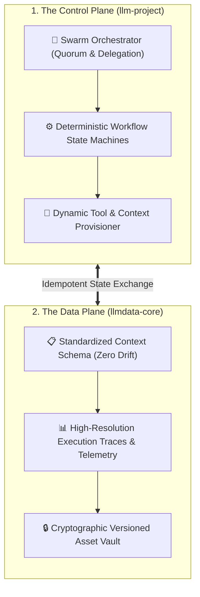

# Consolidated Gemini CLI Workspace: Control Plane & Data Plane
## **Decoupled Swarm Orchestration, Deterministic State Machines & Immutable Context Management**

> [!abstract] Architectural Overview
> In the rapidly evolving landscape of artificial intelligence, managing context, state, and execution across distributed LLM instances requires rigorous architectural discipline. The **Consolidated Gemini CLI Workspace** introduces a decoupled Control Plane and Data Plane architecture to standardize LLM operational contexts and manage complex multi-agent swarms.

Based fundamentally on the `llm-project` and `llmdata-core` repositories, this architecture transforms ad-hoc AI interactions into a deterministic, scalable orchestration engine.

---

## 1. Architecture: Control Plane vs. Data Plane

### A. The Control Plane (`llm-project`)
The Control Plane serves as the central nervous system for AI operations. It governs the orchestration of agents, policy enforcement, routing, and lifecycle management of multi-agent swarms:
* **Swarm Orchestration:** Deploys and manages parallel AI agents for complex problem-solving, utilizing quorum-based decision making and delegated task execution.
* **Workflow Management:** Defines deterministic state machines for AI workflows, ensuring that agents operate within strict, auditable parameters.
* **Skill & Tool Provisioning:** Dynamically provisions agents with required tools, scripts, and context constraints at runtime.

### B. The Data Plane (`llmdata-core`)
The Data Plane acts as the persistent, immutable memory layer. It handles the vast streams of context, telemetry, and artifacts generated and consumed by the agents:
* **Context Standardization:** Enforces a rigid schema for LLM operational contexts, preventing context drift and ensuring high-fidelity recall across long-running sessions.
* **Telemetry & Audit:** Captures high-resolution execution traces for all agentic actions, enabling forensic reconstruction of AI decision paths.
* **Asset Management:** Securely stores and serves artifacts, ensuring that generated assets are strictly version-controlled and cryptographically verifiable.

---

## 2. Deploying Multi-Agent Swarms

Leveraging this architecture, deploying a multi-agent swarm transitions from a manual, error-prone process into a declarative deployment. By defining the swarm topology within the Control Plane and binding it to a standardized context in the Data Plane, we achieve idempotent, highly resilient AI workflows capable of tackling enterprise-scale automation and cybersecurity challenges.

---

## 🔗 Related Architecture & Knowledge Graph

* **Production Systems:** Validated in [[Projects/MCP_Gateway_Tool_Router|MCP Gateway Tool Router]], [[Projects/Serverless_Cloudflare_MCP|Serverless Cloudflare MCP]].
* **Governance & Compliance:** Governed by [[Governance/Policies/AI_Augmentation_for_Users|AI Augmentation for Users]], [[Governance/Policies/Data_Classification_Policy|Data Classification Policy]].
* **Technical Articles:** Deep dive in [[Articles/MCP_In_Enterprise_Operations|MCP In Enterprise Operations]].
* **Applied Research:** Investigated in [[Research/Local_LLM_Architecture|Local LLM Architecture]], [[Research/Security_Analysis_and_Research_Agent/Agents_and_Architecture|Agents and Architecture]].
* **Master Credentials:** Review core competencies on [[Resume/Master_Resume|Curriculum Vitae & Master Resume]].
* **Digital Garden Hub:** Return to the main [[index|Digital Garden Index]].
