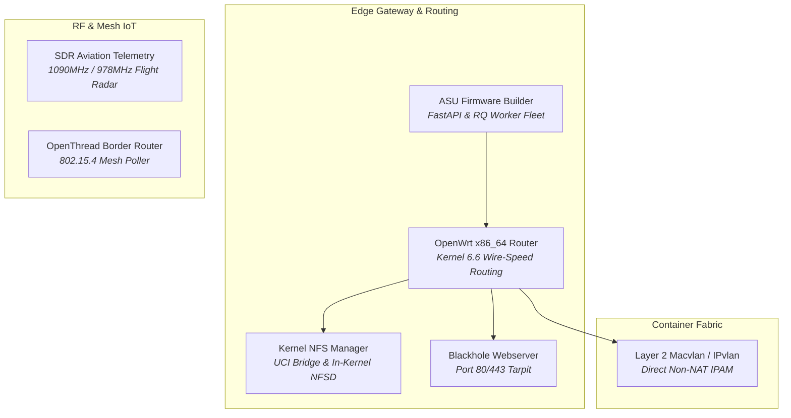

# 🌐 Embedded Networking, Edge Routing & IoT

> **High-throughput edge routing, Linux kernel storage bridging, RF radio demodulation, and zero-NAT container network fabrics.**

---

## 🏛️ Networking & IoT Projects Portfolio

### 1. [[Projects/Networking-and-IoT/OpenWrt_Kernel_NFS_Manager|OpenWrt Kernel NFS Server Manager]]
*Native LuCI web application and UCI configuration engine controlling wire-speed Linux kernel `nfsd` daemons directly on OpenWrt routers with multi-client access control.*

### 2. [[Projects/Networking-and-IoT/OpenWrt_ASU_Image_Builder|OpenWrt Attended Sysupgrade (ASU) Image Builder]]
*Automated on-demand custom kernel and SquashFS firmware compilation pipeline utilizing FastAPI, RQ workers, and isolated OpenWrt ImageBuilder containers.*

### 3. [[Projects/Networking-and-IoT/OpenWRT_Blackhole_Webserver|OpenWRT Blackhole Webserver & Honeypot]]
*Ultra-lightweight edge service serving zero-byte HTTP 200 responses to hostile port scans and web scrapers, mitigating perimeter noise without resource overhead.*

### 4. [[Projects/Networking-and-IoT/OpenThread_Border_Router|OpenThread Border Router Telemetry Poller]]
*802.15.4 low-power wireless mesh network polling daemon extracting node neighbor tables, parent RSSI metrics, and streaming telemetry to MQTT and Grafana.*

### 5. [[Projects/Networking-and-IoT/ADSB_Aviation_SDR_Telemetry_Pipeline|Dual-Band ADS-B & UAT Aviation SDR Telemetry Pipeline]]
*Demodulating 1090MHz Mode S and 978MHz UAT flight telemetry using RTL-SDR hardware, WebGL aircraft radar, and multi-network feeder multiplexing.*

### 6. [[Projects/Networking-and-IoT/SDR_and_RF_Exploration|SDR & RF Telemetry Exploration]]
*Software-Defined Radio research capturing municipal, weather satellite, and ISM band radio frequencies with GNU Radio flowgraphs and automated waterfall recording.*

### 7. [[Projects/Networking-and-IoT/Layer2_Containerization|Layer 2 Virtualization & Non-NAT IPAM]]
*High-density Docker container network architecture using Macvlan and IPvlan driver bridges to eliminate NAT port mapping bottlenecks and provide routable LAN IPs.*

---

## 🧭 Navigation & Cross-Links
- Return to **[[Projects/index|All Projects Master Catalog]]**
- View fleet metrics in **[[Projects/Infrastructure-and-CICD/index|Infrastructure & CI/CD]]**
- Check physical topology in **[[Projects/Homelab/Current_Environment|Current Environment]]**
