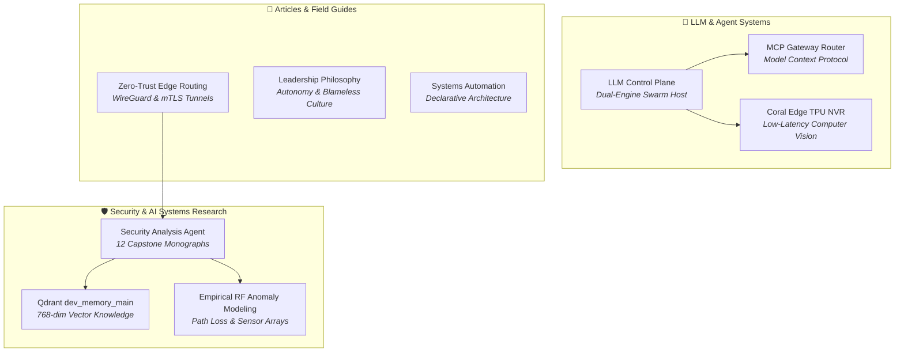

# 🧠 Research & Ramblings: Systems, AI & Security Insights

> **The unified intellectual nexus combining rigorous applied cybersecurity research, autonomous AI multi-agent swarms, localized LLM control planes, technical whitepapers, and engineering leadership essays.**

<nav class="projects-category-bar">
  <a href="#security-ai-research" class="cat-pill">🛡️ Security & AI Research Hub</a>
  <a href="#llm-agents" class="cat-pill">🤖 LLM & Agent Systems</a>
  <a href="#articles" class="cat-pill">📝 Articles & Field Guides</a>
  <a href="#codex-arcana" class="cat-pill">📜 Codex Arcana Vault</a>
</nav>

---

<section id="security-ai-research" class="project-category-section">

## 🛡️ [[Research-and-Ramblings/Security-and-AI-Research-and-Ramblings/index|Security & AI Systems Applied Research Hub]]

The centerpiece of our applied research: a 12-part master thesis and engineering capstone specifying autonomous multi-agent defense swarms, high-dimensional vector memory retrieval, and empirical RF anomaly modeling.

| Monograph / Research Track | Focus & Mathematical Primitives | Artifact Link |
|---|---|---|
| **[[Research-and-Ramblings/Security-and-AI-Research-and-Ramblings/index|Master Thesis & Capstone Executive Summary]]** | Central thesis statement, operational roadmap, and problem definition. | [Executive Summary](https://iamrp.dev/Research-and-Ramblings/Security-and-AI-Research/) |
| **[[Research-and-Ramblings/Security-and-AI-Research/Agents_and_Architecture|Multi-Agent Swarm Topology & Execution Boundaries]]** | Autonomous agent hierarchy, quorum gating consensus, and MCP execution boundaries. | [Architecture Spec](https://iamrp.dev/Research-and-Ramblings/Security-and-AI-Research/Agents_and_Architecture) |
| **[[Research-and-Ramblings/Security-and-AI-Research/Vector_Knowledge_and_Telemetry|Vector Knowledge Base & Memory Datastore]]** | Mathematical foundation of 768-dim Cosine vector space, HNSW indexing ($M=16, ef=100$), and 11,814 chunked vectors in `dev_memory_main`. | [Vector Engine](https://iamrp.dev/Research-and-Ramblings/Security-and-AI-Research/Vector_Knowledge_and_Telemetry) |
| **[[Research-and-Ramblings/Security-and-AI-Research/Empirical_Telemetry_and_RF_Analysis|Empirical Telemetry & RF Anomaly Modeling]]** | Log-distance path loss propagation math, continuous dwell-time anomaly scoring, and physical SDR telemetry. | [RF Modeling](https://iamrp.dev/Research-and-Ramblings/Security-and-AI-Research/Empirical_Telemetry_and_RF_Analysis) |
| **[[Research-and-Ramblings/Security-and-AI-Research/Research_Tracks_Taxonomy|26 Prioritized Research Tracks Taxonomy]]** | Comprehensive academic classification across AI security, Post-Quantum Cryptography, eBPF rootkits, and 5G NTN. | [Research Taxonomy](https://iamrp.dev/Research-and-Ramblings/Security-and-AI-Research/Research_Tracks_Taxonomy) |
| **[[Research-and-Ramblings/Security-and-AI-Research/Lab_Validated_Playbooks|Lab-Validated Defense Playbooks & SOAR]]** | Production-grade Sigma detection rules, Suricata signatures, and automated OpenWrt quarantine scripts. | [SOAR Playbooks](https://iamrp.dev/Research-and-Ramblings/Security-and-AI-Research/Lab_Validated_Playbooks) |
| **[[Research-and-Ramblings/Security-and-AI-Research/DFIR_and_Playbooks|Digital Forensics, Incident Response & eBPF]]** | Live memory acquisition, Volatility 3 kernel symbol forensics, and runtime eBPF telemetry auditing. | [DFIR Engine](https://iamrp.dev/Research-and-Ramblings/Security-and-AI-Research/DFIR_and_Playbooks) |
| **[[Research-and-Ramblings/Security-and-AI-Research/Compliance_and_Governance|Regulatory Compliance, Zero Trust & AI Safety]]** | Control mappings across NIST SP 800-53 Rev 5, NIST SP 800-207 (Zero Trust), ISO 27001:2022, and EU AI Act. | [Compliance Mappings](https://iamrp.dev/Research-and-Ramblings/Security-and-AI-Research/Compliance_and_Governance) |
| **[[Research-and-Ramblings/Security-and-AI-Research/Lab_Requirements|Physical & Virtual Lab Specifications]]** | Hardware ledgers, network interface topology, SDR sensor arrays, and GPU compute specs. | [Lab Ledger](https://iamrp.dev/Research-and-Ramblings/Security-and-AI-Research/Lab_Requirements) |
| **[[Research-and-Ramblings/Security-and-AI-Research/Sources_and_Matrix|Threat Intelligence Ingestion & Attack Matrix]]** | Curated OSINT feeds, Shodan vulnerability mapping, CVE indexing, and MITRE ATT&CK tactic mappings. | [Threat Matrix](https://iamrp.dev/Research-and-Ramblings/Security-and-AI-Research/Sources_and_Matrix) |
| **[[Research-and-Ramblings/Security-and-AI-Research/Skills_and_Gaps|Security Methodology Skill Trees]]** | Granular breakdown of 2,574 security skill definitions, execution frameworks, and open research horizons. | [Skill Trees](https://iamrp.dev/Research-and-Ramblings/Security-and-AI-Research/Skills_and_Gaps) |
| **[[Research-and-Ramblings/Security-and-AI-Research/Tools_and_Telemetry|Operational Instrumentation & Approved Toolsets]]** | Command references, sandboxed execution binaries, and telemetry pipeline configurations. | [Tooling Guide](https://iamrp.dev/Research-and-Ramblings/Security-and-AI-Research/Tools_and_Telemetry) |

</section>

---

<section id="llm-agents" class="project-category-section">

## 🤖 LLM & Agent Systems Research

Architectures governing localized AI model execution, tool routing protocols, and hardware acceleration.

| Research Track | Description | Key Technologies |
|---|---|---|
| **[[Research-and-Ramblings/LLM-and-Agent-Systems/LLM_Control_Plane|Gemini CLI Workspace: Control & Data Plane]]** | Decoupled Control Plane (`llm-project`) and Data Plane (`llmdata-core`) orchestrating parallel subagents and SSE streams. | Python, SSE, Subagents |
| **[[Research-and-Ramblings/LLM-and-Agent-Systems/MCP_Gateway_Tool_Router|MCP Gateway: Enterprise Model Context Protocol]]** | Stateful proxy and aggregator bridging diverse agent runtimes via Model Context Protocol. | TypeScript, MCP, Node |
| **[[Research-and-Ramblings/LLM-and-Agent-Systems/Serverless_Cloudflare_MCP|Serverless Remote MCP on Cloudflare Workers]]** | Edge-native Model Context Protocol server executing tools on Cloudflare's distributed edge with sub-15ms SSE. | Workers, Edge, SSE |
| **[[Research-and-Ramblings/LLM-and-Agent-Systems/Coral_Edge_TPU_Computer_Vision_NVR|Coral Edge TPU Computer Vision & Low-Latency NVR]]** | Google Coral Edge TPU coprocessor (100+ FPS real-time detection), `go2rtc` WebRTC broker, and tmpfs RAM buffers. | Coral TPU, WebRTC, Go |
| **[[Research-and-Ramblings/LLM-and-Agent-Systems/Substrate_Digital_Nervous_System|Substrate — Digital Nervous System]]** | Distributed microservices backbone orchestrating multi-node telemetry and automated proactive agent loops. | Microservices, EventBus |
| **[[Research-and-Ramblings/LLM-and-Agent-Systems/Local_LLM_Architecture|Zero-Trust Local LLM Ingress Architecture]]** | Hardware-accelerated localized LLM inference via Ollama, Qdrant vector retrieval, and Cloudflare SSE tunnels. | Ollama, Qdrant, Tunnels |

</section>

---

<section id="articles" class="project-category-section">

## 📝 [[Research-and-Ramblings/Research-and-Ramblings/Research-and-Ramblings/Articles/index|Articles, Whitepapers & Technical Field Guides]]

A dedicated subsection of long-form architectural essays, leadership philosophy, systems complexity theory, and hardware repair field notes.

| Article / Essay | Core Theme | Category |
|---|---|---|
| **[[Research-and-Ramblings/Articles/Philosophy|Technical Leadership & Management Philosophy]]** | Asynchronous autonomy, psychological safety, blameless engineering culture, and AI-augmented developer velocity. | Leadership & Culture |
| **[[Research-and-Ramblings/Articles/Zero_Trust_Edge|Zero-Trust Edge Routing Whitepaper]]** | WireGuard overlay networks, strict mTLS ingress, and border gateway security patterns. | Whitepaper |
| **[[Research-and-Ramblings/Articles/Systems_Automation|Systems & Automation Architecture]]** | Moving from imperative bash scripting to declarative, self-healing infrastructure state machines. | Systems Architecture |
| **[[Research-and-Ramblings/Articles/Systems_Theory|Games & Systems Complexity]]** | Parallels between systems theory, game mechanics, and complex infrastructure failure modes. | Strategy & Theory |
| **[[Research-and-Ramblings/Articles/MCP_Enterprise|Model Context Protocol in Enterprise Operations]]** | Architectural patterns for safely deploying MCP agent gateways across corporate firewall perimeters. | Architecture |
| **[[Research-and-Ramblings/Articles/Lab_Workstation|/uses Hardware & Stack Specification]]** | Comprehensive hardware build sheet, monitor configurations, thermal profiles, and software stack. | Hardware Spec |
| **[[Research-and-Ramblings/Articles/Component_Repair|Bare-Metal Diagnostics & Board-Level Repair]]** | Practical lessons from component-level SMD board repairs, oscilloscope signal tracing, and thermal analysis. | Electronics & Repair |

</section>

---

<section id="codex-arcana" class="project-category-section">

## 📜 [[Research-and-Ramblings/Codex-Arcana/Codex_Arcana|Codex Arcana Growth Vault]]

The unfiltered chronicle of hard-won engineering lessons, post-mortems, and breakthrough architectural solutions:

> *"True mastery is not the absence of failure, but the systematic documentation and elimination of failure modes."*

- Explore the **[[Research-and-Ramblings/Codex-Arcana/Codex_Arcana|Complete Codex Arcana Record]]**

---

## 🧭 Navigation & Cross-Links
- Return to **[[Projects/index|Engineering & Systems Projects Master Catalog]]**
- Review live homelab apps in **[[Homelab-Projects/index|Homelab Projects]]**
- Browse the **[[Wiki/index|Ecosystem Wiki & Knowledge Base]]**
- Review enterprise policies in **[[Projects/Governance-and-Policies/index|Governance & Policies]]**
