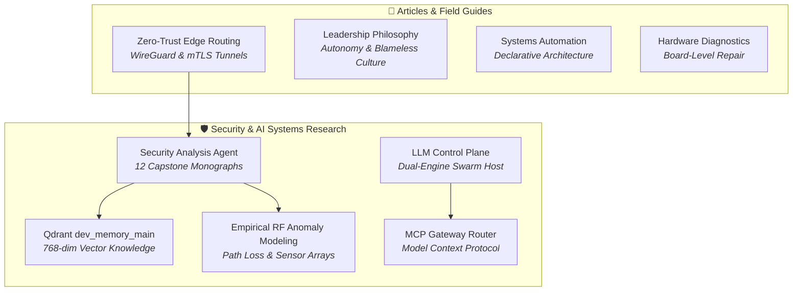

# 🧠 Research & Ramblings

> **The unified intellectual nexus combining rigorous applied cybersecurity research, autonomous AI multi-agent swarms, localized LLM control planes, technical whitepapers, and engineering leadership essays.**

<nav class="projects-category-bar">
  <a href="#security-ai-research" class="cat-pill">🛡️ Security & AI Research</a>
  <a href="#articles" class="cat-pill">📝 Articles & Field Guides</a>
</nav>

---

<section id="security-ai-research" class="project-category-section">

## 🛡️ [[Research-and-Ramblings/Security-and-AI-Research/index|Security & AI Systems Applied Research]]

The centerpiece of our applied research: autonomous multi-agent defense swarms, localized LLM control planes, high-dimensional vector memory retrieval, and empirical RF anomaly modeling.

### Capstone Theses & Security Monographs

| Monograph / Research Track | Focus & Mathematical Primitives |
|---|---|
| **[[Research-and-Ramblings/Security-and-AI-Research/index|Master Thesis & Capstone Executive Summary]]** | Central thesis statement, operational roadmap, and problem definition. |
| **[[Research-and-Ramblings/Security-and-AI-Research/Agents_and_Architecture|Multi-Agent Swarm Topology & Execution Boundaries]]** | Autonomous agent hierarchy, quorum gating consensus, and MCP execution boundaries. |
| **[[Research-and-Ramblings/Security-and-AI-Research/Vector_Knowledge_and_Telemetry|Vector Knowledge Base & Memory Datastore]]** | Mathematical foundation of 768-dim Cosine vector space, HNSW indexing ($M=16, ef=100$), and 11,814 chunked vectors in `dev_memory_main`. |
| **[[Research-and-Ramblings/Security-and-AI-Research/Empirical_Telemetry_and_RF_Analysis|Empirical Telemetry & RF Anomaly Modeling]]** | Log-distance path loss propagation math, continuous dwell-time anomaly scoring, and physical SDR telemetry. |
| **[[Research-and-Ramblings/Security-and-AI-Research/Research_Tracks_Taxonomy|26 Prioritized Research Tracks Taxonomy]]** | Comprehensive academic classification across AI security, Post-Quantum Cryptography, eBPF rootkits, and 5G NTN. |
| **[[Research-and-Ramblings/Security-and-AI-Research/Lab_Validated_Playbooks|Lab-Validated Defense Playbooks & SOAR]]** | Production-grade Sigma detection rules, Suricata signatures, and automated OpenWrt quarantine scripts. |
| **[[Research-and-Ramblings/Security-and-AI-Research/DFIR_and_Playbooks|Digital Forensics, Incident Response & eBPF]]** | Live memory acquisition, Volatility 3 kernel symbol forensics, and runtime eBPF telemetry auditing. |
| **[[Research-and-Ramblings/Security-and-AI-Research/Compliance_and_Governance|Regulatory Compliance, Zero Trust & AI Safety]]** | Control mappings across NIST SP 800-53 Rev 5, NIST SP 800-207 (Zero Trust), ISO 27001:2022, and EU AI Act. |
| **[[Research-and-Ramblings/Security-and-AI-Research/Lab_Requirements|Physical & Virtual Lab Specifications]]** | Hardware ledgers, network interface topology, SDR sensor arrays, and GPU compute specs. |
| **[[Research-and-Ramblings/Security-and-AI-Research/Sources_and_Matrix|Threat Intelligence Ingestion & Attack Matrix]]** | Curated OSINT feeds, Shodan vulnerability mapping, CVE indexing, and MITRE ATT&CK tactic mappings. |
| **[[Research-and-Ramblings/Security-and-AI-Research/Skills_and_Gaps|Security Methodology Skill Trees]]** | Granular breakdown of 2,574 security skill definitions, execution frameworks, and open research horizons. |
| **[[Research-and-Ramblings/Security-and-AI-Research/Tools_and_Telemetry|Operational Instrumentation & Approved Toolsets]]** | Command references, sandboxed execution binaries, and telemetry pipeline configurations. |

### LLM Control Planes, Agent Gateways & Arcana

| Research Track | Description | Key Technologies |
|---|---|---|
| **[[Research-and-Ramblings/Security-and-AI-Research/LLM_Control_Plane|Gemini CLI Workspace: Control & Data Plane]]** | Decoupled Control Plane (`llm-project`) and Data Plane (`llmdata-core`) orchestrating parallel subagents and SSE streams. | Python, SSE, Subagents |
| **[[Research-and-Ramblings/Security-and-AI-Research/MCP_Gateway_Tool_Router|MCP Gateway: Enterprise Model Context Protocol]]** | Stateful proxy and aggregator bridging diverse agent runtimes via Model Context Protocol. | TypeScript, MCP, Node |
| **[[Research-and-Ramblings/Security-and-AI-Research/Serverless_Cloudflare_MCP|Serverless Remote MCP on Cloudflare Workers]]** | Edge-native Model Context Protocol server executing tools on Cloudflare's distributed edge with sub-15ms SSE. | Workers, Edge, SSE |
| **[[Research-and-Ramblings/Security-and-AI-Research/Coral_Edge_TPU_Computer_Vision_NVR|Coral Edge TPU Computer Vision & Low-Latency NVR]]** | Google Coral Edge TPU coprocessor (100+ FPS real-time detection), `go2rtc` WebRTC broker, and tmpfs RAM buffers. | Coral TPU, WebRTC, Go |
| **[[Research-and-Ramblings/Security-and-AI-Research/Substrate_Digital_Nervous_System|Substrate — Digital Nervous System]]** | Distributed microservices backbone orchestrating multi-node telemetry and automated proactive agent loops. | Microservices, EventBus |
| **[[Research-and-Ramblings/Security-and-AI-Research/Local_LLM_Architecture|Zero-Trust Local LLM Ingress Architecture]]** | Hardware-accelerated localized LLM inference via Ollama, Qdrant vector retrieval, and Cloudflare SSE tunnels. | Ollama, Qdrant, Tunnels |
| **[[Research-and-Ramblings/Security-and-AI-Research/Codex_Arcana|Codex Arcana Growth Vault]]** | Systematic documentation of hard-won engineering lessons, root-cause analyses, and breakthrough solutions. | Knowledge Vault |

</section>

---

<section id="articles" class="project-category-section">

## 📝 [Articles & Technical Field Guides (blog.iamrp.dev)](https://blog.iamrp.dev/)

All long-form architectural essays, leadership philosophy, systems complexity theory, and hardware repair field logs are published at **[blog.iamrp.dev](https://blog.iamrp.dev/)**.

| Article / Essay | Core Theme | Category | Link |
|---|---|---|---|
| **Technical Leadership & Management Philosophy** | Asynchronous autonomy, psychological safety, blameless engineering culture, and AI-augmented developer velocity. | Leadership & Culture | [Read on Blog ↗](https://blog.iamrp.dev/articles/Philosophy) |
| **Zero-Trust Edge Routing Whitepaper** | WireGuard overlay networks, strict mTLS ingress, and border gateway security patterns. | Whitepaper | [Read on Blog ↗](https://blog.iamrp.dev/articles/Zero_Trust_Edge) |
| **Systems & Automation Architecture** | Moving from imperative bash scripting to declarative, self-healing infrastructure state machines. | Systems Architecture | [Read on Blog ↗](https://blog.iamrp.dev/articles/Systems_Automation) |
| **Games & Systems Complexity** | Parallels between systems theory, game mechanics, and complex infrastructure failure modes. | Strategy & Theory | [Read on Blog ↗](https://blog.iamrp.dev/articles/Systems_Theory) |
| **Model Context Protocol in Enterprise Operations** | Architectural patterns for safely deploying MCP agent gateways across corporate firewall perimeters. | Architecture | [Read on Blog ↗](https://blog.iamrp.dev/articles/MCP_Enterprise) |
| **/uses Hardware & Stack Specification** | Comprehensive hardware build sheet, monitor configurations, thermal profiles, and software stack. | Hardware Spec | [Read on Blog ↗](https://blog.iamrp.dev/articles/Lab_Workstation) |
| **Bare-Metal Diagnostics & Board-Level Repair** | Practical lessons from component-level SMD board repairs, oscilloscope signal tracing, and thermal analysis. | Electronics & Repair | [Read on Blog ↗](https://blog.iamrp.dev/articles/Component_Repair) |

</section>

---

## 🧭 Navigation & Portals
- Explore all engineering systems in **[[Projects/index|Projects]]**
- Review enterprise credentials in **[[Resume/index|Resume]]**
- Inspect cryptographic identity in **[[Contact/index|Contact]]**
- Consult the technical user manuals and runbooks at **[wiki.iamrp.dev](https://wiki.iamrp.dev)**
