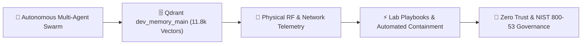

# Security & AI Research Hub
### **Applied Research, Autonomous Multi-Agent Swarms, Vector Memory & Zero-Trust Architectures**

> [!abstract] Research Overview
> This portal serves as the academic and engineering knowledge base for **Richard P. Dissell's** applied security and AI research. It synthesizes autonomous agent design, localized high-performance inference, 768-dimensional vector memory retrieval (`dev_memory_main`), low-level kernel telemetry (eBPF), and empirical radio frequency (RF) anomaly modeling.

---

## 🏛️ Master Thesis & Engineering Capstone

The centerpiece of this research hub is the complete **Security Analysis and Research Agent** capstone suite—a twelve-part academic and engineering specification:

### 📖 Master Thesis Monographs
1. **[[Research/Security_Analysis_and_Research_Agent/index|Master Thesis & Capstone Executive Summary]]** — *Central thesis statement, problem definition, and research roadmap.*
2. **[[Research/Security_Analysis_and_Research_Agent/Agents_and_Architecture|Multi-Agent Swarm Topology & Secure Execution Boundaries]]** — *Autonomous agent hierarchy, quorum gating consensus, and MCP isolation.*
3. **[[Research/Security_Analysis_and_Research_Agent/Vector_Knowledge_and_Telemetry|Vector Knowledge Base & Memory Datastore (dev_memory_main)]]** — *Mathematical foundation of 768-dim Cosine space, HNSW indexing ($M=16, ef=100$), and 11,814 chunked vectors.*
4. **[[Research/Security_Analysis_and_Research_Agent/Empirical_Telemetry_and_RF_Analysis|Empirical Telemetry & RF Anomaly Modeling]]** — *Log-distance path loss propagation math, continuous dwell-time anomaly scoring, and edge findings.*
5. **[[Research/Security_Analysis_and_Research_Agent/Research_Tracks_Taxonomy|26 Prioritized Research Tracks Taxonomy]]** — *Comprehensive academic classification across AI security, PQC, eBPF rootkits, 5G NTN, and supply chains.*
6. **[[Research/Security_Analysis_and_Research_Agent/Lab_Validated_Playbooks|Lab-Validated Defense Playbooks & SOAR Engineering]]** — *Production-grade Sigma detection signatures, Suricata rules, and automated OpenWrt quarantine scripts.*
7. **[[Research/Security_Analysis_and_Research_Agent/DFIR_and_Playbooks|Digital Forensics, Incident Response & Runtime eBPF Telemetry]]** — *Memory acquisition pipelines, Volatility 3 kernel symbol analysis, and runtime eBPF auditing.*
8. **[[Research/Security_Analysis_and_Research_Agent/Compliance_and_Governance|Regulatory Compliance, Zero Trust & AI Safety Governance]]** — *Control mappings across NIST SP 800-53 Rev 5, NIST SP 800-207 (Zero Trust), ISO 27001:2022, and EU AI Act.*
9. **[[Research/Security_Analysis_and_Research_Agent/Lab_Requirements|Physical & Virtual Lab Infrastructure Specifications]]** — *Hardware ledgers, network interface topology, SDR sensor arrays, and compute specifications.*
10. **[[Research/Security_Analysis_and_Research_Agent/Sources_and_Matrix|Threat Intelligence Ingestion & Attack Surface Matrix]]** — *Curated OSINT feeds, Shodan vulnerability mapping, CVE indexing, and MITRE ATT&CK tactic mappings.*
11. **[[Research/Security_Analysis_and_Research_Agent/Skills_and_Gaps|Security Methodology Skill Trees & Research Horizons]]** — *Granular breakdown of the 2,574 security skill definitions, execution frameworks, and open horizons.*
12. **[[Research/Security_Analysis_and_Research_Agent/Tools_and_Telemetry|Operational Instrumentation & Approved Toolsets]]** — *Command references, sandboxed execution binaries, and telemetry pipeline configurations.*

---

## 🛡️ Applied Research Vaults & Infrastructure

- **[[Research/Codex_Arcana|Codex Arcana Growth Vault]]**  
  *The collection of failures, iterative post-mortems, and architectural breakthroughs demonstrating continuous adaptation and growth.*
- **[[Research/Local_LLM_Architecture|Zero-Trust Local LLM Ingress Architecture]]**  
  *Hardware-accelerated localized LLM inference via Ollama, Qdrant vector retrieval, and Cloudflare SSE tunnels.*
- **[[Projects/Current_Environment|Authoritative Host Infrastructure State]]**  
  *Live hardware specs, networking interfaces, OpenWrt router configs, and Docker container ledgers.*
