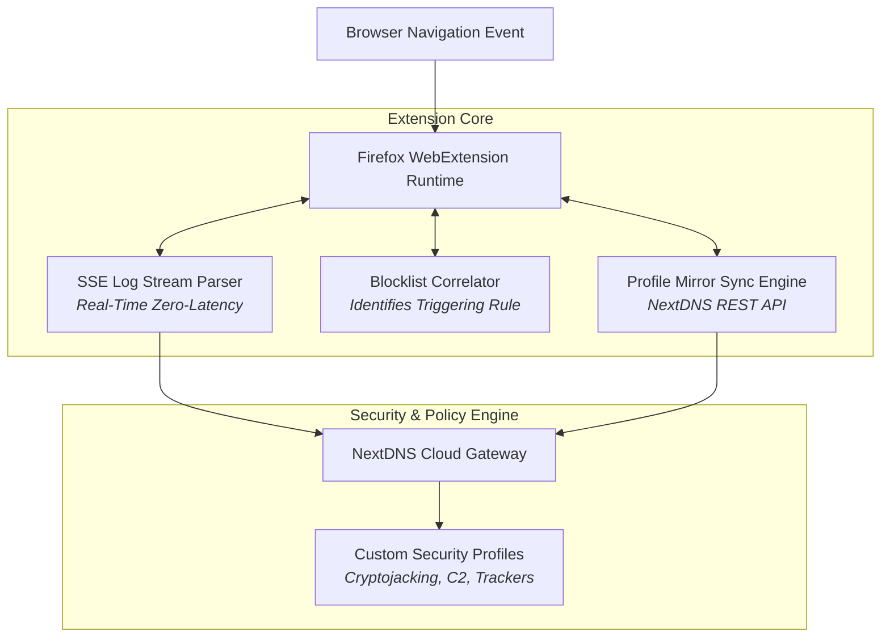

# DNS Forge: NextDNS Firefox Add-on

> [!abstract] Architectural Summary
> Modern privacy-focused web browsing requires dynamic, fine-grained control over DNS-over-HTTPS (DoH) routing and real-time blocklist auditing. **DNS Forge** is a modular Firefox WebExtension built to interface directly with NextDNS APIs, providing real-time Server-Sent Events (SSE) log streaming, blocklist correlation, automated security rule auditing, and multi-profile synchronization.

---

### ◈ Extension Architecture

---

### ◈ Key Technical Features

1. **Zero-Latency SSE Log Streaming:**
   * Uses native `EventSource` connections to stream live DNS queries with sub-millisecond DOM updates.
   * Renders query protocols (DoH, DoQ, IPv6), client IP geolocations, and domain categorization badges.

2. **Real-Time Blocklist Debugger:**
   * When a website breaks, instantly correlates the blocked asset with the exact active security list (e.g. OISD, Steven Black, NextDNS Threat Intelligence) allowing single-click allowlisting.

3. **100% Mozilla AMO Compliance:**
   * Strictly adheres to Firefox Manifest V3 security boundaries with zero unvetted third-party dependencies, clean Content Security Policy (CSP), and automated CodeQL audit pipelines.
